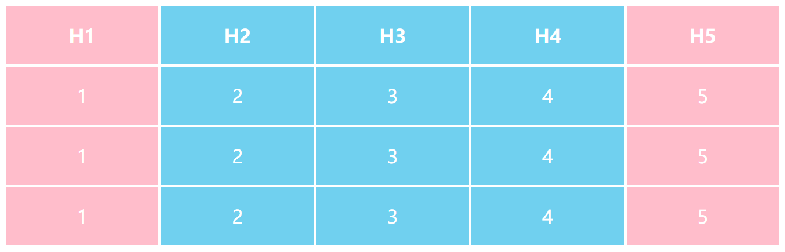

## 什么是 HTML？
##### 难度：★ ☆ ☆ ☆ ☆  面试高频指数：★ ★ ☆ ☆ ☆
 HTML，全称是 HyperText Markup Language，即超文本标记语言，它不是编程语言，而是一种用来告知浏览器如何组织页面的标记语言，用来描述网页的表现，展示效果或功能及行为

* “超文本”（hybertext) 是指连接单个网站或多个网站网页的链接
* HTML 使用“标记”（markup) 来注明文本、图片和其它内容
* HTML 通过“标签”（tag）标记元素，标签由在<和>中包裹的元素名组成
* HTML 标签里的元素名不区分大小写。可以用大写、小写或混合形式书写

## 常用的浏览器引擎是什么 ？
##### 难度：★ ☆ ☆ ☆ ☆  面试高频指数：★ ★ ★ ☆ ☆

浏览器是一种从 Web 获取和显示页面的程序，让用户通超链接访问更多页面

排版引擎（Layout Engine），也称为浏览器引擎（Browser Engine）、页面渲染引擎（Rendering Engine）或样板引擎，它是软件组件，负责获取标记式内容（如 HTML、XML 及图像文件等）和整理信息（如 CSS 及 XSL 等），并将排版后内容输出至显示器或打印机

常见的浏览器排版引擎分别是：

* Mozilla Firefox 使用 Gecko 引擎
* Apple Safari 和 早期 Google Chrome 使用 KDE 引擎，后发展成为 WebKit 引擎
* Internet Explorer 使用 Trident 引擎
* Microsoft Edge 早期使用 EdgeHTML 引擎
* Opera 早期使用 Presto 引擎
* 目前，Google Chrome 及基于 Chromium 浏览器，如 Microsoft Edge，Opera 使用基于 WebKit 分支自行构建的 Blink 引擎

## 请列举常用的 HTML 实体字符 ？
##### 难度：★ ☆ ☆ ☆ ☆  面试高频指数：★ ☆ ☆ ☆ ☆

字符 `<` `>` `"` `'` 和 `&` 等本身是 HTML 语法自身的特殊字符

表示其本身需要使用字符引用，即表示字符的特殊编码，每个字符引用以 & 开始，分号 ; 结束
原义字符 	等价字符引用

<table>
<thead>
<tr>
<th style="text-align:left"><strong>原义字符</strong></th>
<th style="text-align:left"><strong>等价字符引用</strong></th>
</tr>
</thead>
<tbody>
<tr>
<td style="text-align:left">&lt;</td>
<td style="text-align:left">&amp;lt;</td>
</tr>
<tr>
<td style="text-align:left">&gt;</td>
<td style="text-align:left">&amp;gt;</td>
</tr>
<tr>
<td style="text-align:left">"</td>
<td style="text-align:left">&amp;quot;</td>
</tr>
<tr>
<td style="text-align:left">'</td>
<td style="text-align:left">&amp;apos;</td>
</tr>
<tr>
<td style="text-align:left">&amp;</td>
<td style="text-align:left">&amp;amp;</td>
</tr>
<tr>
<td style="text-align:left">空格</td>
<td style="text-align:left">&amp;nbsp;</td>
</tr>
</tbody>
</table>

## HTML 注释如何写 ？
##### 难度：★ ☆ ☆ ☆ ☆  面试高频指数：★ ☆ ☆ ☆ ☆

* HTML 注释使用特殊标记`<!--`和`-->`包裹
* HTML 注释不会被渲染
    * 会被传输
    * 解析时，早期 IE 浏览器使用 HTML 注释区分版本
    * 通常使用 `UglifyJS` 和 `Terser` 或正则匹配的方式，在生产环境删除注释
* HTML 注释用来描述
    * 代码是如何工作的
    * 不同部分代码做了什么

## 么是 HTML 语义化，有什么好处，一定要 HTML 语义化吗 ？
##### 难度：★ ☆ ☆ ☆ ☆  面试高频指数：★ ★ ★ ★ ☆

语义是语言的含义，语义化是前端开发的专用术语，语义类标签是对内容的补充，表达标题摘要，文章结构、强调重点、丰富含义，避免歧义

HTML 语义化的好处包括

* 增强可读性，便于开发和维护

* 增强可访问性，便于屏幕阅读器定位和朗读

* 增强结构清晰度，利于 SEO
    HTML 语义化不是一定要执行的标准

* 利用无语义标签，如`<div>`和`<span>`可以满足几乎所有开发需求

* 可读性，可访问性和 SEO，使用语义化标签不是必须的

* 部分语义化标签存在兼容性问题，如 `<button>` 的默认 `type`不总为 submit 等

* 滥用列表标签，会增加不必要的嵌套，增加额外的 CSS Reset 的样式
    HTML 语义化以外，良好的命名，简明扁平的结构，良好的无障碍设计，清晰的导航和分区，一定程度上，也能弥补语义的欠缺，提升代码的机器阅读体验，降低抓取难度，提高索引权重

在明确知晓语义化标签的含义和组合搭配后，探索其使用的最佳实践和场景，而不是盲目地滥用、错用语义化标签，才能让 HTML 语义化标签体现更好的价值

## 连续空格如何渲染，意义是什么 ？
##### 难度：★ ☆ ☆ ☆ ☆  面试高频指数：★ ☆ ☆ ☆ ☆

* 为了代码的可读性，开发者通常会在 HTML 元素嵌套中使用空白
* 空白可以使用空格或 TAB 缩进实现
* HTML 解释器会将连续出现的空白字符减少为一个单独的空格符
* 如果一定要使用连续空格，可以使用全角空格或者实体字符 `&nbsp`;

## 如何声明文档类型 ？
##### 难度：★ ☆ ☆ ☆ ☆  面试高频指数：★ ★ ☆ ☆ ☆

`<!DOCTYPE html> `是最简单有效的文档类型声明，目的是防止浏览器在渲染文档时，切换到“怪异模式（兼容模式）”。确保浏览器按照最佳相关规范进行渲染，而不是使用一个不符合规范的渲染

## 哪些字符集编码支持简体中文，如何解决 HTML 乱码问题 ？
##### 难度：★ ☆ ☆ ☆ ☆  面试高频指数：★ ★ ☆ ☆ ☆

（1）支持简体中文的字符集编码

* GB 2312
    * 共收录 6763 个汉字，其中一级汉字 3755 个，二级汉字 3008 个，同时收录拉丁字母、希腊字母、日文平假名和片假名字母、俄语西里尔字母在内 682 个字符
    * 使用区位码“分区”，每区含有 94 个汉字 / 符号
        * 01 - 09 区为特殊符号
        * 16 - 55 区为一级汉字，按拼音排序
        * 56 - 87 区为二级汉字，按部署 / 笔画排序
    * 无法处理人名、古汉语中的罕用字和繁体字
* GBK
    * 汉字内码扩展规范
    * 拓展 GB 2312 - 80，拥有 23940 个码位，包括 21003 个汉字，883 个图形符号
    * 兼容 BG 2312 - 80，支持 希腊字母、俄语字母，不支持韩国字
* GB 18030
    * 国家标准 GB 18030 - 2005
    * 多字节编码，编码空间可定义 161 万个字元，包括 70244 个汉字
    * 完全兼容 GB 2312，基本兼容 GBK，支持少数民族文字、繁体汉字和日韩汉字
    BIG5
    * 大五码、五大码
    * 支持 13060 个中文文字
* Unicode
    * 万国码，国际码，统一码或单一码
    * 采用 ISO 10646 通用字符集，应用 UCS-2 使用 16 位编码空间，支持 65536 个字符
    * Unicode 转换格式即 UTF，UTF-8、UTF-16、UTF-32 是将数字转换到程序数据的编码方案
* UTF-8
    * 多字节编码，针对 Unicode 的可变长度字符编码
    * 使用 1 到 6 字节为每字符编码，实际最多 4 字节
        * 1 字节编码：ASCII 字符
        * 2 字节编码：带附加符号的拉丁文、希腊文、西里尔字母、亚美尼亚语、希伯来文、阿拉伯文、叙利亚文等字母
        * 3 字节编码：其他基本多文种平面（BMP）中字符（包含大部分常用字，汉字）
        * 4 字节编码：其他极少使用 Unicode 辅助平面的字符，如 Emoji 字符
* UTF-16
    * 介于 UTF-8 和 UTF-32 间，使用 2 字节或 4 字节存储，长度既固定又可变
* UTF-32
    * 固定长度的编码方案，不管字符编号大小，始终使用 4 字节存储
    * （2）如何解决 HTML 汉字乱码问题

HTML 汉字乱码的原因：

* 客户端不支持 HTML 编码的字符集

* 实际存储的字符集与使用 meta 标签声明的字符集不一致
    * 部分现代浏览器会自动纠正，根据实际使用的字符集编码渲染 HTML
        解决方法：

    * 建议使用 utf-8 存储并在页面添加 <meta charset="utf-8"> 声明编码类型

## 如何验证 HTML 是否正确 ？
##### 难度：★ ☆ ☆ ☆ ☆ 面试高频指数：★ ☆ ☆ ☆ ☆

验证 HTML 的最好方法使用 W3C 创立并维护的标记验证服务，网址如下：

https://validator.w3.org/

提交一个线上 URL，HTML 文件或者代码，网页会返回相应的错误报告

## 什么是 HTML5，HTML5 有哪些新特性 ？
##### 难度：★ ★ ★ ☆ ☆  面试高频指数：★ ★ ★ ★ ★

（1）什么是 HTML5？

HTML5 是定义 HTML 标准的组新版本，具有两个不同的概念：

* HTML5 是一个新版本的 HTML 语言，具有新的元素，属性和行为
* HTML5 有更大的技术集，允许构建多样化和更强大的网站和应用程序

（2）HTML5 有哪些新特性 ？

根据功能，HTML5 新特性可以分为：

* 语义：能够更恰当地描述内容是什么
    * 新的区块和段落元素
        * 举例：
            * `<section>` 表示一个包含在 HTML 文档的独立部分
            * `<article>` 表示文档、页面、应用或网站中的独立结构
            * `<nav>` 表示页面的一部分，其目的是在当前文档或其他文档提供导航链接
            * `<header>` 用于展示介绍性内容辅助导航。包含标题，Logo，搜索框和作者名称
            * `<footer>` 表示最近一个章节或根节点元素的页脚，包含作者，版权，相关链接
            * `<aside>` 表示一个和其余页面内容几乎无关的部分，通常是侧边栏或标注框
            * `<hgroup>`代表文档章节所属的多级别目录
        * 嵌入和允许操作新的多媒体内容
        * 举例：
            * `<audio>` 用于在文档中嵌入音频内容
            * `<video>` 用于再文档嵌入媒体播放器，支持视频及音频播放
    * 表单的改进
        * 强制性校验 API
            * 举例：
                * `required` 必填属性
                * `pattern` 声明正则校验规则属性
                * `minlength` 和 `maxlength` 限制输入的长度
                * `constraint validation API` 检测和自定义表单元素的状态
        * 新 `<input>` 元素的 `type` 属性值
            * 举例：
                * `color` 取色器
                * `date` 日期控件
                * `detetime-local` 不包括时区的日期控件
                * `month` 输入年和月的控件，没有时区
                * `range` 输入不需要精确地数字空间
                * `search` 搜索字符串的单行文字区域
                * `tel` 输入电话号码的控件
                * `time` 输入时间的控件
                * `url` 输入并校验 URL 的控件
    * 其它新的语义元素
        * 举例：
            * `<mark>` 为表示引用或符号目的而标记或突出显示的文本
            * `<figure>` 常与 `<figcaption>` 配合使用，表示独立的说明内容
            * `<data>` 将一个指定内容和机器可读的翻译联系在一起
            * `<time>` 表示机器可读的 24 小时制的时间或者公历日期
            * `<progress>` 显示一项任务的完成进度
            * `<meter>` 用来显示已知范围的标量值或者分数值
            * `<main>` 呈现了文档的 `<body>` 或应用的主体部分
            * `output` 表示计算或用户操作的结果
    * `<iframe>` 的改进
        * 精确控制 `<iframe>` 元素的安全级别和期望的渲染
        * 举例：
            * `sandbox` 对呈现在 `iframe` 框架中的内容启用一些额外的限制条件
            * `srcdoc` 支持的浏览器优先使用 `srcdoc` 代替 `src`
    * `MathML`
        * 用于描述数学公式、符号的一种标记语言，允许直接嵌入数学公式
* 连通性：能够通过创新的新技术方法进行通信
    * `Web Sockets`
        * 允许在页面和服务器之间建立持久连接，并通过这种方法来交换非 HTML 数据
    * `Server-sent events`
        * 允许服务器向客户端推送事件
    * `WebRTC`
        * 支持在浏览器客户端之间语音 / 视频交流和数据分享的技术
        * 浏览器原生支持点对点的分享应用数据和进行电话会议
* 离线 & 存储：能够让网页再客户端本地存储数据并且更高效地离线运行
    * 离线资源：应用程序缓存
        * 缓存 `.manifest` 上的资源，离线或资源没有更新时，浏览器会加载缓存的离线资源
    * 在线和离线事件
        * `navigator.onLine` 返回在线 `true` 或离线 `false`
        * `online` 和 `offline` 事件
            * `window` `document` `document.body` 使用 `addEventListener`
            * `document` `document.body` 的 `.ononline` 或 `.onoffline` 属性设为一个 JavaScript `Function` 对象
            * `<body>` 标签上指定 `ononline="..."` 或 `onoffline="..."` 属性
    * WHATWG 客户端会话和持久化存储（又名 DOM 存储）
        * `Storage`
            * DOM 存储被设计为用户提供一个更大存储量，更安全，更便捷的存储方法
            * 代替掉将一些不需要让服务器知道的信息存储到 `cookies` 里的这种传统方法
            * 构造函数 `Storage` 及其实例
                * `seesionStorage` 全局对象，维护着页面会话期间有效的存储空间，重新载入或从崩溃中恢复不会丢失
                * `localStorage` 全局对象，本次持久化存储，隐身模式下关闭浏览器会丢弃
    * `IndexedDB`
        * 用于在客户端存储大量的结构化数据，包括文件 / 二进制大型对象（blobs）
        * 使用索引实现对数据的高性能搜索
    * 在 Web 应用程序中使用文件
        * File API：可以访问 `FileList`，包含表示用户所选择的 `File` 对象
            * `name` 文件名称，只读字符串，只包含文件名，不包含任何路径信息
            * `size` 以字节数为单位的文件大小，只读的 64 位整数
            * `type` 文件的 MIME 类型，只读字符串，当类型不能确定为 ""
        * 通过 `change` 事件访问被选择的文件
            * `this.files`
        * 通过 `drogenter` `dragover` `drag` 的 `dataTransfer` 的 `files` 中获取文件列表
        * 对象 URL `window.URL.createObjectURL()` 和 `window.URL.revokeObjectURL()`
* 多媒体：加快普及 video 和 audio 应用，丰富 web 表现力
    * HTML5 音视频
        * `<video>` 和 `<audio>` 标签以及 JavaScript 和 APIs 用于对其进行控制
    * WebRTC
        * 支持在浏览器客户端之间语音 / 视频交流和数据分享的技术
        * 浏览器原生支持点对点的分享应用数据和进行电话会议
    * Camera API
        * 使用手机的摄像头拍照，然后把拍到的照片发送给当前网页
    * Track 和 WebVTT
        * `<track>` 元素怒被当作媒体元素 `<audio>` 和 `<video>` 的子元素
        * WebVTT（Web 视频文本跟踪格式）使用 `<track>` 元素现实定时文本轨道（如字幕或标题）的格式化，支持 `VTTCue` 和 `VTTRegion` 接口
* 2D/3D 绘图 & 效果：提供定制图形、动画界面的新选择
    * Canvas
        * `<canvas>` 元素被用来通过 JavaScript （Canvas API 或 WebGL API）绘制图形及图形动画
        * HTML5 文本 API 由 `<canvas>` 支持
            * `fillText(text, x, y, [, maxWidth])` 在指定的 (x, y) 位置填充指定的文本
            * `strokeText(text, x, y, [, maxWidth]` 在指定的 (x, y) 位置绘制文本边框
        * WebGL
            * WebGL （Web 图形库） 是一个 JavaScript API，可在任何兼容的 Web 浏览器中渲染高性能的交互式 3D 和 2D 图形，无需使用插件
                * WebGL 引入 OpenGL ES 2.0，通过 `canvas.getContext('webgl')` 使用
                * WebGL 2 引入 OpenGL ES 3.0，通过 `canvas.getContext('webgl2')` 使用
        * SVG
            * SVG （可缩放矢量图形）是一种描述二维的矢量图形，基于 XML 的标记语言
            * 优雅而简洁地渲染不同大小的图形，并和 CSS，DOM，JavaScript 和 SMIL 等其他网络标准无缝衔接
            * 可以搜索、索引、编写脚本和压缩，也可以使用任何文本编辑器和绘图软件来创建和编辑 SVG
* 性能 & 集成：提供作用显著的性能优化方案，更有效地使用设备硬件
    * Web Workers
        * 为 Web 内容在后台线程中运行脚本提供一种简单方法
        * 线程可以执行任务而不干扰用户界面
        * 专用 worker
            * `new Worker()` 构建
                通过 `postMessage()` 和 `onmessage` 事件函数发送和接收消息
        * 共享 worker
            * `new SharedWorker() `构建
            * 通过 ` port`.`postMessage()` 和 `port.onmessage` 事件函数发送和接收消息
                * worker 中需先使用 `onconnect `获取 `port`
    * XMLHttpRequest Level 2
        * 可以设置 HTTP 请求的时限
        * 可以使用 FormData 对象管理表单数据
        * 可以上传文件
        * 可以请求不同域名下的数据（跨域请求）
        * 可以获取服务器端的二进制数据
        * 可以获得数据传输的进度信息
    * 即时编译的 JavaScript 引擎
        * 新一代的 JavaScript 引擎更强大，性能更杰出
    * History API
        * History 接口允许操作浏览器的曾经在标签页或者框架里访问的会话历史记录
        * 属性
            * `History.length` 返回一个整数，该整数表示会话历史中元素的数目，包括当前加载的页
            * `History.scrollRestoration` 允许 Web 应用程序在历史导航上显式地设置默认滚动恢复行为。此属性可以是自动的（auto）或者手动的（manual）
            * `History.state` 返回一个表示历史堆栈顶部的状态的值。这是一种可以不必等待 `popstate` 事件而查看状态的方式
        * 方法
            * `History.back()` 在浏览器历史记录里前往上一页，用户可以点击浏览器左上角的返回按钮模拟此方法，等价于 `history.go(-1)`
            * `History.forward()` 在浏览器历史记录中前往下一页，用户可以点击浏览器左上角的前进按钮模拟此方法，等价于 `history.go(1)`
            * `History.go()` 通过当前页面的相对位置从浏览器历史记录（会话记录）加载页面
            * `History.pushState()` 按指定的名称和 URL（如果提供该参数）将数据 push 进会话历史栈，数据被 DOM 进行不透明处理，你可以指定任何可以被序列化的 JavaScript 对象
            * `History.replaceState()` 按指定的数据，名称和 URL（如果提供该参数）更新历史栈上最新的入口。这个数据被 DOM 进行了不透明处理。您可以指定任何可以被序列化的 JavaScript 对象
    * Content Editable
        * HTML 中任何元素都可以被编辑，设置 `contenteditable` 属性为 `true` 即可
        * HTML5 将此属性标准化
    * HTML 拖放 API
        * HTML 拖放（Drag and Drop）接口使应用程序能够在浏览器中私用拖放功能
        * 引入拖放功能的基本步骤
            * 确定可拖拽元素
                * 给元素添加 `draggable` 属性，添加全局事件处理函数 `ondragstart`
                定义拖拽数据
                * 通过 `drag event` 的 `dataTransfer` 属性访问事件数据
                * 通过 `dataTransfer `的 `setData()` 方法为拖拽数据添加一个项
                * 通过 `dataTransfer `的 `setDrageImage` 方法定义拖拽图像
                * 通过 `dataTransfer `的 `dropEffect` 属性定义拖拽效果
                    * `copy `表明拖拽的数据将从它原本的位置拷贝到目标的位置
                    * `move` 表明被拖拽的数据将被移动
                    * `link` 表明拖拽源位置和目标之间将会创建一些关系表格或是连接
            * 确定放置区域
                * 给元素添加 `ondragover` 和 `ondrop` 事件处理程序属性
            * 定义放置效果
                * 通过 `dataTransfer `的 `dropEffect` 属性定义拖拽效果
            * 拖拽结束
                * 拖拽操作结束时，在源元素（开始拖拽时的目标元素）上触发 dragend 事件
                * 不管拖拽是完成还是取消，这个事件都会被触发
    * HTML 焦点管理
        * DOM 属性 `activeElement` 与方法 `hasFocus()` 为程序按提供了更好的控制页面交互的能力，特别是丢与用户行为引发的交互
            * `activeElement` 只读属性，用来返回当前在 DOM 或者 shadow DOM 树中处于聚焦状态的 `Element`
            * ```Do``cumen``t.hasFocus()``` 方法返回一个 Boolean，表明当前文档或者文档内的节点是否获得了焦点。该方法可以用来判断当前文档中的活动元素是否获得了焦点
        * 两者关系
            * 获得焦点的元素一定是当前文档的活动元素
            * 一个文档中的活动元素不一定获得了焦点
    * 基于 Web 的协议处理程序
        * 使用 `navigator.registerProtoolHandler(scheme,url, title)` 方法把 web 应用程序注册成一个协议处理程序
    * requestAnimationFrame
        * 传入一个回调函数，该回调函数会在浏览器下一次重绘之前执行
    * 全屏 API
        * `全屏 API` 为使用用户的整个屏幕展现网络内容提供了一种简单的方式，不需要时退出全屏模式
        * 方法
            * `Document.exitFullscreen()` 用于请求从全屏模式切换到窗口模式，会返回一个 `Promise`，会在全屏模式完全关闭的时候，被重置为 `resolved` 状态
            * `Element.requestFullscreen()` 请求浏览器将特定元素置为全屏模式，隐去屏幕上的浏览器所有 UI 元素，以及其它应用
        * 属性
            * `DocumentOrShadowRoot.fullscreenElement` `fullscreenElement` 属性提供了当前在 DOM（或者 shadow DOM）里被展示为全屏模式的 `Element`，如果这个值为 `null`，文档不处于全屏模式
            * `Document.fullscreenEnabled` `fullscreenEnabled` 属性提供了启用全屏模式的可能性。当它的值是 `false` 的时候，表示全屏模式不可用
        * 事件处理程序
            * Document 事件处理程序 `onfullscreenchange` 和 `onfullscreenerror`
            * Element 事件处理程序 `onfullscreenchange` 和 `onfullscreenerror`
    * 指针锁定 API
        * 光标移到浏览器或者屏幕区域之外，指针锁定也能够让你访问鼠标事件
        * 指针锁定是持久性的。指针锁定不释放鼠标，直到作出一个显式的 API 调用或者用户使用一个专门的释放手势
        * 指针锁定不局限于浏览器或者屏幕边界
        * 指针锁定持续发送事件，而不管鼠标按钮状态如何
        * 指针锁定隐藏光标
        * 指针锁定目前需要先进入全屏模式 `requestFullscreen()` 然后执行 `requestPointerLock()` 方法
    * 在线和离线事件
        * `navigator.onLine` 返回在线 `true` 或离线 `false`
        * `online` 和 `offline` 事件
            * `window` `document` `document.body` 使用 `addEventListener`
            * `document` `document.body` 的 `.ononline` 或 `.onoffline` 属性设为一个 JavaScript `Function` 对象
            * `<body>` 标签上指定 `ononline="..."` 或 `onoffline="..."` 属性
* 设备访问 ：能够处理各种输入和输出设备
    * Camera API
        * 使用手机的摄像头拍照，然后把拍到的照片发送给当前网页
    * 触摸事件
        * 触摸事件提供了在触摸屏或触控板商解释手指（或触控笔）活动的能力
        * 触摸事件接口可为程序提供多点触控交互的支持，分为开始、移动、结束三个阶段
        * 接口
            * `TouchEvent` 接口将当前所有活动的触摸点封装起来
            * `Touch` 接口表示单独一个触摸点，其中包括浏览器视角的相对坐标
            * `TouchList` 表示一组 `Touch`，用于多点触控的情况
    * 使用地理位置定位
        * 地理位置 API 允许用户向 Web 应用程序提供他们的位置
        * 出于隐私考虑，报告地理位置和前会先请求用户许可
        * 方法，通过 `navigator.geolocation` 提供
            * `getCurrentPosition(success[, error[, options]])` 用来获取设备当前位置
            * `watchPosition(success[, error, options]])` 用于注册监听器，在设备的地理位置发生改变的时候自动被调用，返回一个 `id`
            * `clearWatch(id)` 清除注册的位置及错误监听器
    * 检测设备方向
        * `DeviceOrientationEvent` 它会在加速度传感器检测到设备在方向上产生变化时触发
        * `DeviceMotionEvent` 它会在加速度发生改变时触发
    * 指针锁定 API
        * 光标移到浏览器或者屏幕区域之外，指针锁定也能够让你访问鼠标事件
        * 指针锁定是持久性的。指针锁定不释放鼠标，直到作出一个显式的 API 调用或者用户使用一个专门的释放手势
        * 指针锁定不局限于浏览器或者屏幕边界
        * 指针锁定持续发送事件，而不管鼠标按钮状态如何
        * 指针锁定隐藏光标
        * 指针锁定目前需要先进入全屏模式 `requestFullscreen()` 然后执行 `requestPointerLock()` 方法
* 样式设计：支持创作更复杂的主题

## 什么是 MIME types，常见的 MIME types 有哪些 ？
##### 难度：★ ☆ ☆ ☆ ☆  面试高频指数：★ ☆ ☆ ☆ ☆

MIMEtype（现在称为“媒体类型（media type）”，但有时也是“内容类型”（content type））是指示文件类型的字符串，与文件一起发送（例如，一个声音文件可能被标记为 `audio/ogg` 一个图像文件可能是 `image/png` ）。它与传统 Windows 上的文件扩展名有相同目的

`NavigatorPlugins.mimeTypes` 返回一个 `MimeTypeArray` 对象，其中包含可被当前浏览器识别的 `MimeType` 对象列表

两种主要的 MIME 类型

`text/plain` 表示文本文件的默认值，一个文本文件应当是人类可读的，并且不包含二进制数据

`application/octet-stream` 表示所有其他情况的默认值。一种未知的文件类型应当使用此类型。浏览器在处理这些文件时会特别小心，试图防止、避免用户的危险行为

Web 常见的 MIME 类型

<table>
<thead>
<tr>
<th style="text-align:left"><strong>扩展名</strong></th>
<th style="text-align:left"><strong>文档类型</strong></th>
<th style="text-align:left"><strong>MIME 类型</strong></th>
</tr>
</thead>
<tbody>
<tr>
<td style="text-align:left">.aac</td>
<td style="text-align:left">AAC audio</td>
<td style="text-align:left">audio/aac</td>
</tr>
<tr>
<td style="text-align:left">.abw</td>
<td style="text-align:left">AbiWord document</td>
<td style="text-align:left">application/x-abiword</td>
</tr>
<tr>
<td style="text-align:left">.arc</td>
<td style="text-align:left">Archive document</td>
<td style="text-align:left">application/x-freearc</td>
</tr>
<tr>
<td style="text-align:left">.avi</td>
<td style="text-align:left">Audio Video Interleave</td>
<td style="text-align:left">video/x-msvideo</td>
</tr>
<tr>
<td style="text-align:left">.azw</td>
<td style="text-align:left">Amazon Kindle eBook format</td>
<td style="text-align:left">application/vnd.amazon.ebook</td>
</tr>
<tr>
<td style="text-align:left">.bin</td>
<td style="text-align:left">Any kind of binary data</td>
<td style="text-align:left">application/octet-stream</td>
</tr>
<tr>
<td style="text-align:left">.bmp</td>
<td style="text-align:left">Windows OS / 2 Bitmap Graphics</td>
<td style="text-align:left">image/bmp</td>
</tr>
<tr>
<td style="text-align:left">.bz</td>
<td style="text-align:left">BZip archive</td>
<td style="text-align:left">application/x-bzip</td>
</tr>
<tr>
<td style="text-align:left">.bz2</td>
<td style="text-align:left">BZip2 archive</td>
<td style="text-align:left">application/x-bzip2</td>
</tr>
<tr>
<td style="text-align:left">.csh</td>
<td style="text-align:left">C-Shell script</td>
<td style="text-align:left">application/x-csh</td>
</tr>
<tr>
<td style="text-align:left">.css</td>
<td style="text-align:left">Cascading Style Sheets</td>
<td style="text-align:left">text/css</td>
</tr>
<tr>
<td style="text-align:left">.csv</td>
<td style="text-align:left">Comma-separated values</td>
<td style="text-align:left">text/csv</td>
</tr>
<tr>
<td style="text-align:left">.doc</td>
<td style="text-align:left">Microsoft Word</td>
<td style="text-align:left">application/msword</td>
</tr>
<tr>
<td style="text-align:left">.docx</td>
<td style="text-align:left">Microsoft Word（OpenXML）</td>
<td style="text-align:left">application/vnd.openxmlformats-officedocument.wordprocessingml.document</td>
</tr>
<tr>
<td style="text-align:left">.eot</td>
<td style="text-align:left">MS Embedded OpenType fonts</td>
<td style="text-align:left">application/vnd.ms-fontobject</td>
</tr>
<tr>
<td style="text-align:left">.epub</td>
<td style="text-align:left">Electronic publication（EPUB）</td>
<td style="text-align:left">application/epub+zip</td>
</tr>
<tr>
<td style="text-align:left">.gif</td>
<td style="text-align:left">Graphics Interchange Format（GIF）</td>
<td style="text-align:left">image/gif</td>
</tr>
<tr>
<td style="text-align:left">.htm<br>.html</td>
<td style="text-align:left">HyperText Markup Language（HTML）</td>
<td style="text-align:left">text/html</td>
</tr>
<tr>
<td style="text-align:left">.ico</td>
<td style="text-align:left">Icon format</td>
<td style="text-align:left">image/vnd.microsoft.icon</td>
</tr>
<tr>
<td style="text-align:left">.ics</td>
<td style="text-align:left">iCalendar format</td>
<td style="text-align:left">text/calendar</td>
</tr>
<tr>
<td style="text-align:left">.jar</td>
<td style="text-align:left">Java Archive（JAR）</td>
<td style="text-align:left">application/java-archive</td>
</tr>
<tr>
<td style="text-align:left">.jpeg<br>.jpg</td>
<td style="text-align:left">JPEG images</td>
<td style="text-align:left">image/jpeg</td>
</tr>
<tr>
<td style="text-align:left">.js</td>
<td style="text-align:left">JavaScript</td>
<td style="text-align:left">text/javascript</td>
</tr>
<tr>
<td style="text-align:left">.json</td>
<td style="text-align:left">JSON format</td>
<td style="text-align:left">application/json</td>
</tr>
<tr>
<td style="text-align:left">.jsonld</td>
<td style="text-align:left">JSON-LD format</td>
<td style="text-align:left">application/ld+json</td>
</tr>
<tr>
<td style="text-align:left">.mid<br>.midi</td>
<td style="text-align:left">Musical Instrument Digital Interface（MIDI）</td>
<td style="text-align:left">audio/midi<br>audio/x-midi</td>
</tr>
<tr>
<td style="text-align:left">.mjs</td>
<td style="text-align:left">JavaScript module</td>
<td style="text-align:left">text/javascript</td>
</tr>
<tr>
<td style="text-align:left">.mp3</td>
<td style="text-align:left">MP3 Audio</td>
<td style="text-align:left">audio/mpeg</td>
</tr>
<tr>
<td style="text-align:left">.mpeg</td>
<td style="text-align:left">MPEG Video</td>
<td style="text-align:left">video/mpeg</td>
</tr>
<tr>
<td style="text-align:left">.mpkg</td>
<td style="text-align:left">Apple Installer Package</td>
<td style="text-align:left">application/vnd.apple.installer+xml</td>
</tr>
<tr>
<td style="text-align:left">.odp</td>
<td style="text-align:left">OpenDocument presentation document</td>
<td style="text-align:left">application/vnd.oasis.opendocument.presentation</td>
</tr>
<tr>
<td style="text-align:left">.ods</td>
<td style="text-align:left">OpenDocument<br>spreadsheet document</td>
<td style="text-align:left">application/vnd.oasis.opendocument.spreadsheet</td>
</tr>
<tr>
<td style="text-align:left">.odt</td>
<td style="text-align:left">OpenDcoument text document</td>
<td style="text-align:left">application/vnd.oasis.opendocument.text</td>
</tr>
<tr>
<td style="text-align:left">.oga</td>
<td style="text-align:left">OGG audio</td>
<td style="text-align:left">audio/ogg</td>
</tr>
<tr>
<td style="text-align:left">.ogv</td>
<td style="text-align:left">OGG video</td>
<td style="text-align:left">video/ogg</td>
</tr>
<tr>
<td style="text-align:left">.ogx</td>
<td style="text-align:left">OGG</td>
<td style="text-align:left">application/ogg</td>
</tr>
<tr>
<td style="text-align:left">.otf</td>
<td style="text-align:left">OpenType font</td>
<td style="text-align:left">font/otf</td>
</tr>
<tr>
<td style="text-align:left">.png</td>
<td style="text-align:left">Portable Network Graphics</td>
<td style="text-align:left">image/png</td>
</tr>
<tr>
<td style="text-align:left">.pdf</td>
<td style="text-align:left">Adobe Portable Document Format（PDF）</td>
<td style="text-align:left">application/pdf</td>
</tr>
<tr>
<td style="text-align:left">.ppt</td>
<td style="text-align:left">Microsoft PowerPoint</td>
<td style="text-align:left">application/vnd.ms-powerpoint</td>
</tr>
<tr>
<td style="text-align:left">.pptx</td>
<td style="text-align:left">Microsoft PowerPoint（OpenXML）</td>
<td style="text-align:left">application/vnd.openxmlformats-officedocument.presentationml.presentation</td>
</tr>
<tr>
<td style="text-align:left">.rar</td>
<td style="text-align:left">RAR archive</td>
<td style="text-align:left">application/x-rar-compressed</td>
</tr>
<tr>
<td style="text-align:left">.rtf</td>
<td style="text-align:left">Rich Text  Format（RTF）</td>
<td style="text-align:left">application/rtf</td>
</tr>
<tr>
<td style="text-align:left">.sh</td>
<td style="text-align:left">Boume shell script</td>
<td style="text-align:left">application/x-sh</td>
</tr>
<tr>
<td style="text-align:left">.svg</td>
<td style="text-align:left">Scalable Vector Graphics（SVG）</td>
<td style="text-align:left">image/svg+xml</td>
</tr>
<tr>
<td style="text-align:left">.swf</td>
<td style="text-align:left">Small web format（SWF）or Adobe Flash document</td>
<td style="text-align:left">application/x-shockwave-flash</td>
</tr>
<tr>
<td style="text-align:left">.tar</td>
<td style="text-align:left">Tape Archive（TAR）</td>
<td style="text-align:left">application/x-tar</td>
</tr>
<tr>
<td style="text-align:left">.tif<br>.tiff</td>
<td style="text-align:left">Tagged Image File Format（TIFF）</td>
<td style="text-align:left">image/tiff</td>
</tr>
<tr>
<td style="text-align:left">.ttf</td>
<td style="text-align:left">TrueType Font</td>
<td style="text-align:left">font/ttf</td>
</tr>
<tr>
<td style="text-align:left">.txt</td>
<td style="text-align:left">Text</td>
<td style="text-align:left">text/plain</td>
</tr>
<tr>
<td style="text-align:left">.vsd</td>
<td style="text-align:left">Microsoft Visio</td>
<td style="text-align:left">application/vnd.visio</td>
</tr>
<tr>
<td style="text-align:left">.wav</td>
<td style="text-align:left">Waveform Audio Format</td>
<td style="text-align:left">audio/wav</td>
</tr>
<tr>
<td style="text-align:left">.weba</td>
<td style="text-align:left">WEBM audio</td>
<td style="text-align:left">audio/webm</td>
</tr>
<tr>
<td style="text-align:left">.webm</td>
<td style="text-align:left">WEBM video</td>
<td style="text-align:left">video/webm</td>
</tr>
<tr>
<td style="text-align:left">.webp</td>
<td style="text-align:left">WEBP image</td>
<td style="text-align:left">image/webp</td>
</tr>
<tr>
<td style="text-align:left">.woff</td>
<td style="text-align:left">Font  Format（WOFF）</td>
<td style="text-align:left">font/woff</td>
</tr>
<tr>
<td style="text-align:left">.woff2</td>
<td style="text-align:left">Web Open Font Format（WOFF）</td>
<td style="text-align:left">font/woff2</td>
</tr>
<tr>
<td style="text-align:left">.xhtml</td>
<td style="text-align:left">XHTML</td>
<td style="text-align:left">application/xhtml+xml</td>
</tr>
<tr>
<td style="text-align:left">.xls</td>
<td style="text-align:left">Microsoft Excel</td>
<td style="text-align:left">application/vnd.ms-excel</td>
</tr>
<tr>
<td style="text-align:left">.xlsx</td>
<td style="text-align:left">Microsoft Excel（OpenXML）</td>
<td style="text-align:left">application/vnd.openxmlformats-officedocument.spreadsheetml.sheet</td>
</tr>
<tr>
<td style="text-align:left">.xml</td>
<td style="text-align:left">XML</td>
<td style="text-align:left">application/xml 代码对普通用户来说不可读<br>text/xml 代码对普通用户来说可读</td>
</tr>
<tr>
<td style="text-align:left">.xul</td>
<td style="text-align:left">XUL</td>
<td style="text-align:left">application/vn.mozila.xul+xml</td>
</tr>
<tr>
<td style="text-align:left">.zip</td>
<td style="text-align:left">ZIP archive</td>
<td style="text-align:left">application/zip</td>
</tr>
<tr>
<td style="text-align:left">.3gp</td>
<td style="text-align:left">3GPP<br>audio/video container</td>
<td style="text-align:left">video/3gpp<br>audio/3gpp</td>
</tr>
<tr>
<td style="text-align:left">.3g2</td>
<td style="text-align:left">3GPP2<br>audieo/video container</td>
<td style="text-align:left">video/3gpp2<br>audio/3gpp2</td>
</tr>
<tr>
<td style="text-align:left">.7z</td>
<td style="text-align:left">7-zip archive</td>
<td style="text-align:left">application/x-7z-compressed</td>
</tr>
</tbody>
</table>

## 什么是 ARIA？
##### 难度：★ ★ ★ ☆ ☆  面试高频指数：★ ★ ★ ★ ★

ARIA（Accessible Rich Internet Applications）是能够让残障人士更加便利地访问 Web 内容和使用 Web 应用的一套机制，来自 W3C 的网络无障碍计划（Web Accessibility Initiative）

* ARIA 是对超文本标记语言（HTML）的补充，以便在没有其他机制的情况下，使得应用程序中常用的交互和小部件可以传递给辅助交互技术
* ARIA 是一组特殊的易用性属性，可以添加到任意标签上，尤其适用于 HTML。role 属性定义了对象的通用类型（例如文章、警告、或幻灯片）。额外的 ARIA 属性提供了其他有用的特性，例如表单的描述或进度条的当前值
* ARIA 在大多数流行的浏览器和屏幕阅读器中得到了实现
* 开发人员应该更倾向使用对应的语义化 HTML 元素，而不是使用 ARIA

# 元素
## 什么是 HTML 标签 ？
##### 难度：★ ☆ ☆ ☆ ☆  面试高频指数：★ ☆ ☆ ☆ ☆

* HTML 超文本标记语言标记标签通常被称为 HTML 标签
* HTML 标签是 HTML 语言中最基本单位和重要组成部分
* HTML 标签不区分大小写，从一致性、可读性等方面来说，最好仅使用小写字母
* HTML 标签以尖括号（ `<` `>` ）开始和结束
    * 通常成对出现，分别是开始标签和结束标签，也可以称为开放标签和闭合标签
    * 自闭合标签只有其本身，在开始标签中自动闭合

## HTML 标签区分大小写吗 ？
##### 难度：★ ☆ ☆ ☆ ☆  面试高频指数：★ ☆ ☆ ☆ ☆

* HTML 标签不区分大小写
    * 输入标签时，既可以使用大写字母，也可以使用小写字母
* 从一致性、可读性等方面来说，最好仅使用小写字母

## 什么是 HTML 元素 ？
##### 难度：★ ☆ ☆ ☆ ☆  面试高频指数：★ ☆ ☆ ☆ ☆

HTML 元素是指从开始标签到结束标签的所有代码

* 开始标签：包含元素的名称，被左、右角括号所包围。表示元素从这里开始或者开始起作用
* 结束标签：与开始标签相似，只是其在元素名之前包含了一个斜杠，表示着元素的结尾
* 内容：元素的内容
* 元素：开始标签、结束标签与元素相结合，便是一个完整的元素

## HTML 元素有哪些分类方法 ？
##### 难度：★ ★ ☆ ☆ ☆  面试高频指数：★ ★ ☆ ☆ ☆

* 按闭合特征分类
    * 双标签元素：开始标签和结束标签成对，中间包括内容
    * 单标签元素：空元素，开始标签自动闭合，没有内容
* 按显示方式分类
    * 行内元素（内联元素）
        * 只占据它对应标签的边框所包含的空间
        块级元素
        * 占据其父元素（容器）的整个空间
        * 通常浏览器会在块级元素前后另起一行
        * 块级元素可以包含行内元素和其他块级元素
* 按 HTML5 规范文档（HTML-conformant document）分类
    * 主内容类：描述了很多元素共享的内容规范
        * 元数据内容（Metadata content）：此类元素修改文档的其余部分的陈述或者行为，建立与其他文档的链接，或者传达其他外带信息
            * 举例： `<base>` `<link>` `<meta>` `<noscript>` `<script>` `<style>` `<title>`
        * 流式元素（Flow content）：此类元素同行包含文本或植入的内容
            * 举例：   `<a>` `<abbr>` `<address>` `<article>` `<aside>` `<audio>` `<b>` `<bdo>` `<bdi>` `<blockquote>` `<br>` `<button>` `<canvas>` `<cite>` `<code>` `<data>` `<datalist>` `<del>` `<details>` `<dfn>` `<div>` `<dl>` `<em>` `<embed>` `<fieldset>` `<figure>` `<footer>` `<form>` `<h1>` `<h2>` `<h3>` `<h4>` `<h5>` `<h6>` `<header>` `<hgroup>` `<hr>` `<i>` `<iframe>` `` `<input>` `<ins>` `<kbd>` `<label>` `<main>` `<map>` `<mark>` `<math>` `<menu>` `<meter>` `<nav>` `<noscript>` `<object>` `<ol>` `<output>` `<p>` `<pre>` `<progress>` `<q>` `<ruby>` `<s>` `<samp>` `<script>` `<section>` `<select>` `<small>` `<span>` `<strong>` `<sub>` `<sup>` `<svg>` `<table>` `<template>` `<textarea>` `<time>` `<ul>` `<var>` `<video>` `<wbr>`  等和 Text
            * 以下元素仅限于某种特殊情况，属于此类
                * `<area>` 仅限于它作为 `<map>` 的子元素时
                * `<link>` 仅限于 `itemprop` 属性存在的情形
                * `<meta>` 仅限于 `itemprop` 属性存在的情形
                * `<style>` 仅限于 `scoped` 属性存在的情形
        * 章节元素（Heading content）：隶属于分节内容模型的元素，再当前的大纲中创建一个分节。此分节将定义 <`header>` 元素、 `<footer>` 元素和标题元素的范围
            * 举例： `<article>` `<aside>` `<nav>` 和 `<section>`
        * 标题元素（Heading content）：定义了分节的标题，而这个分节可能由一个明确的分节内容元素直接标记，也可能由标题本身隐式地定义
            * 举例： `<h1>` - `<h6>` 和 `<hgroup>`
        * 短语元素（Phrasing content）：规定文本和它包含的标记，一些短语元素构成段落
            * 举例：   `<abbr>` `<audio>` `<b>` `<bdo>` `<br>` `<button>` `<canvas>` `<cite>` `<code>` `<datalist>` `<dfn>` `<em>` `<embed>` `<i>` `<iframe>` `` `<input>` `<kbd>` `<label>` `<mark>` `<math>` `<meter>` `<noscript>` `<object>` `<output>` `<progress>` `<q>` `<ruby>` `<samp>` `<script>` `<select>` `<small>` `<span>` `<strong>` `<sub>` `<sup>` `<svg>` `<textarea>` `<time>` `<var>` `<video>` `<wbr>` 和 plain text
            * 以下元素仅限于某种特殊情况，属于此类
                * `<a>` 仅限于它包含 phrasing content 时
                * `<area>` 仅限于它作为 `<map>` 的子元素时
                * `<del>` 仅限于它包含 phrasing content 时
                * `<ins>` 仅限于它包含 phrasing content 时
                * `<link>` 仅限于 `itemprop` 属性存在的情形
                * `<map>` 仅限于它包含 phrasing content 时
                * `<meta>` 仅限于 `itemprop` 属性存在的情形
        * 嵌入元素（Embedded content）：输入另一个资源或者将来自另一种标记语言或命名空间的内容插入到文档中
            * 举例： `<audio>` `<canvas>` `<embed>` `<iframe>` `` `<math>` `<object>` `<svg>` `<video>`
            交互元素（Interactive content）：交互式内容包含为用户交互而特别设计的元素
            * 举例： `<a>` `<button>` `<details>` `<embed>` `<iframe>` `<label>` `<select>` 和 `<textarea>`
            * 以下元素仅限于某种特殊情况，属于此类
                * `<audio>` 仅限于 `controls` 属性存在
                * `` 仅限于 `usemap` 属性存在
                * `<input>` 仅限于 `type` 属性不处于隐藏（hidden）状态
                * `<menu>` 仅限于 `type` 属性处于工具栏（toolbar）状态
                * `<object>` 仅限于 `usemap` 属性存在
                * `<video>` 仅限于 `controls` 属性存在
    * 表单相关内容类：描述了表单相关元素共有的内容规范
        * 可列举的元素（listed）
            * 举例： `<button>` `<fieldset>` `<input>` `<object>` `<output>` `<select>` 和 `<textarea>`
        * 可标签的元素（labelable）
            * 可以和 `<label>` 相关联的元素
            * 举例： `<button>` `<input>` `<meter>` `<output>` `<progress>` `<select>` 和 `<textarea>`
        * 可提交的元素（submittable）
            * 包括当表单提交时，可以用来组成表单数据的元素
            * 举例： `<button>` `<input>` `<object>` `<select>` 和 `<textarea>`
        * 可重置的元素（resettable）
            * 当表单重置时会被重置的元素
            * 举例： `<input>` `<output>` `<select>` 和 `<textarea>`
    * 特殊内容类：描述了仅在某些特殊元素商才需要遵守的规范，通常这些元素都有特殊的上下文关系
        * 支持脚本元素：不会直接渲染输出在页面文档中。被用来存放脚本代码及脚本代码所要用到的数据
            * 举例： `<script>` `<template>`
        * 透明内容模型元素（Transparent content model）
            * 如果一个元素拥有透明内容模型，将透明标签删除，依然是合法的 HTML5 元素
            * 举例： `<del>` `<ins>`

## 什么是 HTML 头部元素 ？
##### 难度：★ ☆ ☆ ☆ ☆  面试高频指数：★ ☆ ☆ ☆ ☆

HTML 头部元素，即 `<head>` 元素

* HTML 头部元素的内容不会在浏览器中显示
* HTML 头部元素的作用是保存页面的标题、元数据

## 什么是元数据 ？
###### 难度：★ ☆ ☆ ☆ ☆  面试高频指数：★ ☆ ☆ ☆ ☆

* 元数据（Metadata），简单的来说就是描述数据的数据
* HTML 文件在头部元素，即 `<head>` 标签中包含描述该文档的元数据
* HTML 元数据通常使用 `<meta>` 标签表示，共有 4 种类型
    * 如果设置了 `name` 属性
        * `meta` 元素提供的是文档级别（document-level）的元数据，应用于整个页面
        * `meta` 指定了元素的类型，说明该元素包含了什么类型的信息
        * 与 `content` 一起使用，后者指定实际的元数据内容，用来添加 `author` `description` 用于提交作者、摘要和 SEO
    * 如果设置了 `http-equiv` 属性
        * `meta` 元素则是编译指令，提供的信息与类似命名的 HTTP 头部相同
        * `content-security-policy`
            * 允许页面作者定义当前页的内容策略
            * 指定允许的服务器源和脚本，有助于防止跨站点脚本攻击（XSS）
        * `content-type`
            * 用于声明文档类型，如 `text/html; charset=utf-8`
        * `default-style`
            * 设置默认 CSS 样式表组的名称
            * `content` 属性的值必须匹配同一文档中一个 `link` 元素上的 `title` 属性的值
        * `x-ua-compatible`
            * `content` 属性必须为 `IE=edge`
        * `refresh`
            * `content` 只包含一个正整数，则为重新载入页面的时间间隔（秒）
            * `content` 包含一个正整数，并且后面跟着字符串 `;ulr=` 和一个合法的 URL，则是重定向到指定链接的时间间隔（秒）
    * 如果设置了 `charset` 属性，
        * `meta` 元素是一个字符集声明，告诉文档使用哪种字符编码
        * 值与 ASCII 大小写（ASCII case-insensitive）无关，如 `utf-8`
        * 如果设置了 `itemprop` 属性，`meta` 元素提供用户定义的元数据
        * `content` 属性对应用户定义的值，可用于数据标记和结构化数据提交
        * `property` 属性通常与 `itemprop`作用一致，如 Facebook 编写的元数据协议（Open Graph protocol）使用 `property` 声明属性名

## 什么是 Open Graph protocol？
##### 难度：★ ☆ ☆ ☆ ☆  面试高频指数：★ ☆ ☆ ☆ ☆

元数据协议（Open Graph Data）由 Facebook 编写制定的 Metatags 规格，用来标注页面

* 帮助社交媒体、搜索引擎高效、准确地获取网页的标题、主图及元数据
* 使得网页在社交分享及搜索结果中有更好的展现
* 除网页外，还可以用于声明将音乐、视频、文章、书籍、用户信息等转换为图形对象
* 应用元数据协议，需要在页面添加 `<meta>` 标签放在网页的 `<head>` 中，其中包括：

基本元数据

* og:title - 标题

* og:type - 对象类型

* og:image - 图像 URL

* og:url - 对象 URL
* 可选元数据

* og:audio - 音频文件 URL

* og:description - 描述

* og:determiner - 出现在对象标题前的单词，可选 a / an / the / auto，默认为空

* og:locale - 语言环境，格式为 language_TERRITORY，默认为 en_US

* og:locale:alternate - 页面可用的其他语言环境数组

* og:site_name - 网站名称，如 Facebook

* og:video - 视频 URL
    结构化属性

某些属性可以附加额外的元数据

* og:image
    * og:image:url - 图像 URL
    * og:image:secure_url - HTTPS 下的图像 URL
    * og:image:type - 图像 MIME 类型
    * og:image:width - 图像宽度
    * og:image:height - 图像高度
    * og:image:alt - 图像内容描述（不是标题）
* og:video
    * og:video:url - 视频 URL
    * og:video:secure_url - HTTPS 下的视频 URL
    * og:video:type - 视频 MIME 类型
    * og:video:width - 视频宽度
    * og:video:height - 视频高度
* og:audio
    * og:audio:url - 音频 URL
    * og:audio:secure_url - HTTPS 下的音频 URL
    * og:audio:type - 音频 MINE 类型


## 给页面添加标题，都有哪些最佳实践 ？
##### 难度：★ ★ ★ ☆ ☆  面试高频指数：★ ☆ ☆ ☆ ☆

页面标题通过 `<title>` 定义文档的标题

* 显示在浏览器的标题栏或者标签页

* 只包含文本，若是包含有标签，则它包含标签，则它包含的任何标签都将被忽略
* 页面标题的内容对搜索引擎优化（SEO）具有重要意义

* 通常，较长的描述性标题要比简短或一般性标题更好
    * 标题的内容是搜索引擎算法用来确定在搜索结果中列出页面顺序的因子之一
    * 同样，标题是初始的“挂钩”，您可以通过它吸引浏览搜索结果页面的读者的注意力

* 撰写好标题的准则和技巧
    * 避免使用一两个单词的标题。对于词汇表或参考样式的页面，请使用描述性短语或术语定义对
    * 搜索引擎通常显示页面标题的前 55 至 60 个字符。超出此范围的文本可能会丢失，因此请尽量不要使标题更长。如果您必须使用较长的标题，请确保重要的部分出现再前面，并且标题中可能要删除的部分中没有关键内容
    * 不要使用“关键字集合”。如果标题只是关键词列表，则算法通常会降低页面在搜索结果中的位置
    * 尝试确保您的标题在您自己的网站中尽可能唯一。标题重复（或几乎重复）可能会导致搜索结果不准确

## 常见的内容结构标签有哪些，为什么我们需要结构化 ？
##### 难度：★ ★ ★ ☆ ☆  面试高频指数：★ ☆ ☆ ☆ ☆

（1）常见的结构标签有哪些？

* 章节

<table>
<thead>
<tr>
<th style="text-align:left"><strong>元素</strong></th>
<th style="text-align:left"><strong>描述</strong></th>
</tr>
</thead>
<tbody>
<tr>
<td style="text-align:left">&lt;main&gt;</td>
<td style="text-align:left">定义文档中主要或重要的内容</td>
</tr>
<tr>
<td style="text-align:left">&lt;header&gt;</td>
<td style="text-align:left">定义页面或章节的头部。它包含 Logo、页面标题和导航性的目录</td>
</tr>
<tr>
<td style="text-align:left">&lt;footer&gt;</td>
<td style="text-align:left">定义页面或章节的尾部。它包含版权信息、法律信息链接和反馈建议用的地址</td>
</tr>
<tr>
<td style="text-align:left">&lt;body&gt;</td>
<td style="text-align:left">代表 HTML 文档的内容。在文档中只能有一个 &lt;body&gt; 元素</td>
</tr>
<tr>
<td style="text-align:left">&lt;section&gt;</td>
<td style="text-align:left">定义文档中的一个章节</td>
</tr>
<tr>
<td style="text-align:left">&lt;nav&gt;</td>
<td style="text-align:left">定义只包含导航链接的章节</td>
</tr>
<tr>
<td style="text-align:left">&lt;article&gt;</td>
<td style="text-align:left">定义可以独立于内容其余部分的完整独立内容块</td>
</tr>
<tr>
<td style="text-align:left">&lt;aside&gt;</td>
<td style="text-align:left">定义和页面内容关联度较低的内容，如果被删除，剩下的内容仍然合理</td>
</tr>
<tr>
<td style="text-align:left">&lt;address&gt;</td>
<td style="text-align:left">定义包含联系信息的一个章节</td>
</tr>
<tr>
<td style="text-align:left">&lt;h1&gt;-&lt;h6&gt;</td>
<td style="text-align:left">标题元素实现了六层文档标题，&lt;h1&gt; 是最大的标题，&lt;h6&gt; 是最小的标题<br>标题元素简要地描述章节的主题</td>
</tr>
</tbody>
</table>

* 组织

<table>
<thead>
<tr>
<th style="text-align:left"><strong>元素</strong></th>
<th style="text-align:left"><strong>描述</strong></th>
</tr>
</thead>
<tbody>
<tr>
<td style="text-align:left">&lt;p&gt;</td>
<td style="text-align:left">定义一个段落</td>
</tr>
<tr>
<td style="text-align:left">&lt;hr&gt;</td>
<td style="text-align:left">代表章节、文章或其他长内容中的段落之间的分隔符</td>
</tr>
<tr>
<td style="text-align:left">&lt;pre&gt;</td>
<td style="text-align:left">代表其内容已经预先排版过，格式应当保留</td>
</tr>
<tr>
<td style="text-align:left">&lt;blockquote&gt;</td>
<td style="text-align:left">代表引用自其他来源的内容</td>
</tr>
<tr>
<td style="text-align:left">&lt;ol&gt;</td>
<td style="text-align:left">定义一个有序列表</td>
</tr>
<tr>
<td style="text-align:left">&lt;ul&gt;</td>
<td style="text-align:left">定义一个无序列表</td>
</tr>
<tr>
<td style="text-align:left">&lt;li&gt;</td>
<td style="text-align:left">定义列表中的一个列表项</td>
</tr>
<tr>
<td style="text-align:left">&lt;dl&gt;</td>
<td style="text-align:left">定义一个定义列表（一系列术语和其定义）</td>
</tr>
<tr>
<td style="text-align:left">&lt;dt&gt;</td>
<td style="text-align:left">定义一个由下一个 &lt;dd&gt; 定义的术语</td>
</tr>
<tr>
<td style="text-align:left">&lt;dd&gt;</td>
<td style="text-align:left">代表出现在它之前的术语的定义</td>
</tr>
<tr>
<td style="text-align:left">&lt;figure&gt;</td>
<td style="text-align:left">代表一个和文档有关的图例</td>
</tr>
<tr>
<td style="text-align:left">&lt;figcaption&gt;</td>
<td style="text-align:left">代表一个图例的说明</td>
</tr>
<tr>
<td style="text-align:left">&lt;div&gt;</td>
<td style="text-align:left">代表一个通用的容器，没有特殊含义</td>
</tr>
</tbody>
</table>


（2）为什么我们需要结构化？

* 便于用户在短时间内通过标题和开头找到相关内容，避免用户感到沮丧并离开
* 搜索引擎将标题视为影响排名的关键因素，没有标题，影响 SEO
* 严重视力障碍者使用听力，通过屏幕阅读器浏览网页。阅读器提供了快速访问给定文本内容的方法。通过听标题，用户能快速找到所需信息，而不需要听整个文档的大声朗读
* 便于使用 CSS 或 JavaScript 时，定位相关内容的元素

## 列表标签都有哪些 ？
##### 难度：★ ★ ☆ ☆ ☆  面试高频指数：★ ☆ ☆ ☆ ☆
* `<ol>` 定义一个有序列表，通常渲染为一个带编号的列表

* `<ul>` 定义一个无序列表，表示一个内可含多个元素的无序列表或项目符号列表

* `<dl>` 定义一个定义列表或描述列表元素，是一个包含术语定义以及描述的列表，通常用于展示词汇表或者元数据（键值对列表）

* `<dt>` 用于在一个定义列表中声明一个术语。该元素仅能作为 `<dl>` 子元素出现

* `<dd>` 用来指明一个描述列表（ `<dl>`）元素中一个术语的描述

    * 这个元素只能作为描述列表元素的子元素出现，并且必须跟在 `<dt>` 元素后

## 常见的标记引用标签有什么 ？
##### 难度：★ ★ ☆ ☆ ☆  面试高频指数：★ ☆ ☆ ☆ ☆

HTML 有用于标记引用的特性，常见的标记引用标签包括：

* 块引用
    * HTML`<blockquote>` 元素（或者 HTML 块级引用元素），代表其中文字是引用内容
    * 渲染时，块引用内容会有一定缩进
    * 若引文来源于网路，则可以将原内容的出处 URL 地址设置到 `<cite>`属性上
* 行内引用
    * HTML `<q>` 元素表示一个封闭的并且是短的行内引用的文本
    * 短文本专用，不要引入换行符。长文本使用 `<blockquote>`
    * 大多数现代浏览器会为 `<q>`文本添加引号。旧浏览器可能需要使用 CSS 添加引号
    引文
    * `<cite>` 属性内容不会被浏览器现实、屏幕阅读器阅读，需使用 JavaScript 或 CSS，浏览器才会显示 `cite` 内容
    * `<cite>` 元素附上链接可以确保引用的来源在页面上是可显示的

## 如何标记缩略语 ？
##### 难度：★ ☆ ☆ ☆ ☆  面试高频指数：★ ☆ ☆ ☆ ☆

用 `<abbr>` 包裹一个缩略语或缩写，在 `title`中提供缩写的解释

`<acronym>` 基本上与 `<abbr>` 相同，专门用于首字母缩略词而不是缩略语

## 如何标记作者的联系方式 ？
##### 难度：★ ☆ ☆ ☆ ☆  面试高频指数：★ ☆ ☆ ☆ ☆

用 `<address>` 包裹 HTML 文档编写人的联系方式，支持内嵌纯文字和其它标签

## 如何现实一个化学方程式或数学公式，如何表示上标和下标 ？
##### 难度：★ ☆ ☆ ☆ ☆  面试高频指数：★ ☆ ☆ ☆ ☆

上标用 `<sub>` 和下标用 `<sup>` 与字母即可组合化学方程式或数学公式，例如

    (X+1)<sub>2</sub>=4 // 数学公式
    CO<sup>2</sup> // 化学方程式二氧化碳

## 如何标记计算机代码 ？
##### 难度：★ ★ ☆ ☆ ☆  面试高频指数：★ ☆ ☆ ☆ ☆

* `<code>` 呈现一段计算机代码。通常使用浏览器的默认等宽字体显示
* `<pre>` 用来表示预定义格式文本
    * 文本通常按照原文件中的编排，以等宽字体的形式展现出来
    * 文本中的空白符（比如空白和换行符）都会显示出来
* `<var>` 表示数学表达式或变成上下文中的变量名称
    * 该行为取决于浏览器，使用当前字体的斜体形式显示
* `<kbd>` 用于表示用户输入，产生一个行内元素，通常使用浏览器 monospace 字体显示
* `<samp>` 用于标识计算机程序输出，通常使用浏览器缺省 monotype 字体显示

## 如何标记时间和日期 ？
##### 难度：★ ★ ☆ ☆ ☆  面试高频指数：★ ☆ ☆ ☆ ☆

* `<time>` 用来表示 24 小时制时间或者公历日期，表示日期时可以包含时间和时区
* `<time>` 意在以机器可读的格式表示日期和时间
* `datetime` 属性表示此元素的时间和日期，属性值必须是有效的日期格式，并可包含时间

## 如何设置副标题 ？
##### 难度：★ ★ ☆ ☆ ☆  面试高频指数：★ ☆ ☆ ☆ ☆

可以简单地使用 `<p>` 标签包裹副标题，或者使用标题 + `:` + 副标题的格式来声明副标题

在 HTML5 （W3C）规范中建议使用 `<hgroup>` 来表示副标题，虽然该元素已经从规范中删除，但它仍在 WHATWG 的 HTML 版本里。W3C 规范中的副标题示例代码如下：
```HTML
<!DOCTYPE HTML>
<html lang="en">
<title>Chronotype: CS Student</title>
<hgroup>
<h1> The morning </h1>
<h2> 06:00 to 12:00 </h2>
</hgroup>
<p>We sleep.</p>
<hgroup>
<h1> The afternoon </h1>
<h2> 12:00 to 18:00 </h2>
</hgroup>
<p>We study.</p>
<hgroup>
<h2>Additional Commentary</h2>
<h3>Because not all this is necessarily true</h3>
<h6>Ok it's almost certainly not true</h6>
</hgroup>
<p>Yeah we probably play, rather than study.</p>
<hgroup>
<h1> The evening </h1>
<h2> 18:00 to 00:00 </h2>
</hgroup>
<p>We play.</p>
<hgroup>
<h1> The night </h1>
<h2> 00:00 to 06:00 </h2>
</hgroup>
<p>We play some more.</p>
</html>
```
## 表象元素都有哪些 ？
##### 难度：★ ☆ ☆ ☆ ☆  面试高频指数：★ ☆ ☆ ☆ ☆

表象元素是指仅影响表象，没有语义的元素

`<b>` `<i>` 和 `<u>` 出现于要在文本中使用粗体、斜体和下划线但 CSS 仍然不支持的时期

表象元素不应该再被使用，因为

* 使用语义标签更有利于可读性、可访问性和 SEO
* 使用 CSS 管理样式，更利于性能优化、维护和拓展

## HTML 布局元素有哪些 ？
##### 难度：★ ☆ ☆ ☆ ☆  面试高频指数：★ ☆ ☆ ☆ ☆

HTML 布局元素通常是指内容分区元素，它将文档内容从逻辑上进行组织划分

使用页眉（header）、页脚（footer）、导航（nav）和标题（h1 - h6）等分区元素，来为页面内容创建明确的大纲，以便区分各个章节的内容

* `<main>` 呈现了文档的 `<body>` 或应用的主体部分，主体部分是文档的主题或主要功能
* `<article>` 元素表示文档、页面、应用或网站中的独立结构，可独立分配或复用
* `<section>` 表示在文档中的独立片段，通常包含一个标题
* `<aside>` 表示与页面主体无关，可以独立出来的部分
* `<header>` 用于展示简介，用于辅助导航或显示文章摘要，通常包含标题、Logo、搜索框、作者名称、发布时间
* `<nav>` 用于展示导航，包含到其他主要目录的链接
* `<footer>` 表示最近一个章节内容或者根节点元素的页脚。页脚通常包含该章节作者、版权数据或者与文档相关的链接
* `<address>` 表示联系信息，关联上下文，可以是地址、网址、邮箱、电话、社交账号等
* `<h1>` - `<h6>` 表示 6 个从小到大不同级别的标题， `<h1>` 级别最高， `<h6>` 级别最低

## 无语义元素有哪些，什么时候使用 ？
##### 难度：★ ☆ ☆ ☆ ☆  面试高频指数：★ ☆ ☆ ☆ ☆

无语义元素包含表象元素和 `<div>` 和 `<span>` 元素

* 表象元素包括 `<b>` `<i>` `<u>` 等仅仅影响表象但没有语义的元素，出于可读性、可访问性和 SEO 的考虑，应使用 CSS 代替它们，不再直接使用
* 将一组元素作为一个单独的实体用 CSS 修饰或 JavaScript 调用
    * `<div>` 是一个块级无语义元素，应仅用于找不到更好的块级元素时，或者不想增加特定的意义时
    * `<span>` 是一个内联无语义元素，最好只用于无法找到更好的语义元素来包含内容时，或者不想增加特定的含义时。

## 什么是可替换元素，为什么称它们为可替换元素 ？
##### 难度：★ ★ ☆ ☆ ☆  面试高频指数：★ ★ ☆ ☆ ☆

可替换元素即展现效果不由 CSS 控制，而是引用外部对象，其外观独立于 CSS，大多数情况下，CSS 仅能影响可替换元素的位置和定位方式

典型的可替换元素：

* `<iframe>`

* `<video>`

* `<embed>`

* ``

* 类型为 `image` 的 `<input>` 元素
有些元素在特定情况下可作为可替换元素处理：

* `<option>`

* `<audio>`

* `<canvas>`

* `<object>`

* `<applet>`
匿名的可替换元素：

* 用 CSS 的 `content` 属性插入的对象

## 哪些标签会阻塞浏览器渲染 ？
##### 难度：★ ★ ★ ☆ ☆  面试高频指数：★ ★ ★ ☆ ☆

* `<script>` 标签会阻塞 DOM 解析
    * 内联 `<script>` 中的 JavaScript 执行完毕后，触发渲染
    * 外链 `<script>`
        * 位于 `<body>` 中，触发渲染之前的元素
        * 其它位置，不触发渲染
* `<link>` 标签不阻塞 DOM 解析，阻塞渲染和其后 JavaScript 执行
* `` `<video>` `<audio>` 等可替换标签不阻塞 DOM 解析，不阻塞渲染，等渲染树生成且资源已下载后，再渲染

## 如何强制手机浏览器采用真实可视窗口宽度来加载网页 ？
##### 难度：★ ★ ☆ ☆ ☆  面试高频指数：★ ★ ★ ☆ ☆

添加 `<meta>` 标签，设置 `viewport` 属性

    <meta name=”viewport” content=”width=device-width">

* `width=device-width` 宽度是设备屏幕的宽度
* 常用于移动端自适应布局，并与以下设置项搭配使用：

* `initial-scale=1.0` 表示初始缩放比例 1.0

* `minimum-scale=1.0` 表示最小缩放比例 1.0

* `maximum-scale=1.0` 表示最大缩放比例 1.0

* `user-scalable=yes` 表示用户是否可以调整缩放比例
***
# 属性
## 什么是 HTML 属性 ？
##### 难度：★ ☆ ☆ ☆ ☆  面试高频指数：★ ☆ ☆ ☆ ☆

HTML 元素拥有属性（Attribute）

* HTML 属性不会出现在实际的内容中
* HTML 属性包含元素的额外信息，被用来
    * 配置元素
    * 调整元素的行为

## HTML 属性必须包括哪些内容 ？
##### 难度：★ ☆ ☆ ☆ ☆  面试高频指数：★ ☆ ☆ ☆ ☆

一个属性必须包含如下内容

* 一个空格，在属性和元素名称之间
* 属性名称，后面跟着一个等于号
* 一个属性值，由一对引号“”引起来

## 什么是布尔属性 ？
##### 难度：★ ☆ ☆ ☆ ☆  面试高频指数：★ ☆ ☆ ☆ ☆

布尔属性是值可以省略的属性

* 只声明属性名，等同于声明设置一个属性值与属性名相同的属性
* 不声明属性名，则表示该元素没有该属性，不具备该属性值所描述的配置或行为

## 属性值的引号的可以省略吗 ？
##### 难度：★ ☆ ☆ ☆ ☆  面试高频指数：★ ☆ ☆ ☆ ☆

属性值省略引号

* 这是被允许的
* 当属性值包含空格、引号时，可能让浏览器误解标记
* 始终建议添加引号
    * 避免浏览器误解标记的问题
    * 使代码更易读
    * 单引号或者双引号都可以成对使用，这只是风格问题，但不能混用

## 如何链接到 HTML 文档的特定部分（文档片段）？
##### 难度：★ ☆ ☆ ☆ ☆  面试高频指数：★ ☆ ☆ ☆ ☆

链接到 HTML 文档的特定部分，即文档片段，需要

* 给要链接的元素分配一个 `id` 属性
* 链接到特定 `id` 设置 `href` 属性
    * 不同文档，在 URL 结尾使用 `#` 指向 `id`
    * 同一文档，直接使用 `#` 指向 `id`

## 浏览器如何对待引号没有闭合的属性，如何理解 HTML 的宽松解析 ？
##### 难度：★ ★ ★ ☆ ☆  面试高频指数：★ ★ ☆ ☆ ☆

（1）浏览器只解释非编译 HTML

* 浏览器不会将 HTML 编译成其它形式，而是直接解释并显示结果
* 浏览器解析 HTML 的过程比编程语言编译运行的过程要宽松得多

（2）什么是 HTML 的宽松解析

* 通常写错代码会带来以下两种主要类型的错误
    * 语法错误：由通常是拼写错误，熟悉语法并理解错误信息后很容易修复
    * 逻辑错误：不存在语法错误，但代码运行结果不符合预期。通常逻辑错误比语法错误更难修复，因为无法得到指向错误源头的信息
    因为浏览器是以宽松模式解析 HTML
    * HTML 本身不容易出现语法错误，出现语法错误时，浏览器仍会继续解析 HTML
    * 浏览器使用内建规则来解析语法错误，例如未关闭标签，未关闭属性和嵌套混乱元素
        * 标签，属性和层级会被自动修复
        * 修复结果不一定符合开发者预期
        * 存在 XSS，版式混乱，内容错误等隐患

（3）为什么 HTML 要宽松解析

因为 Web 创建的初心就是：

* 人人可发布内容，不去纠结代码语法
* 如果 Web 以严格风格起步，也许就不会像今天这样流行

## 什么是微数据 ？
##### 难度：★ ★ ★ ★ ☆  面试高频指数：★ ☆ ☆ ☆ ☆

HTML5 微数据允许通过特定的机器可读的标签来标记内容，只需向已有内容添加一组键值对

微数据由键值对组成，每一组称为项，每个键值对可以用属性表示

* itemscope
    * 用来声明一组微数据

* itemprop
    * 用来声明键名
        * 属性不同，值相同：一个标签，声明多个键名，空格分隔
        * 属性相同，值不同：多个标签，声明相同键名
        键值
        * 通常是字符串，即元素内容
        * URL
            * `<a>` 标签的 `href` 属性
            * `` 标签的 `src` 属性
        * value
            * 对于不适合给人类展示的内容，使用 `value` 声明内容
            * `<meter>` 标签的 `value` 属性
            * `<time>` 标签的 `datetime` 属性
        * itemscope
            * 键值可以嵌套另一组微数据

    itemref
    用来关联不在 imtescope 所在标签的后代的属性

    itemtype
        指定结构化数据词汇的 URL，其中定义的标准且唯一的词汇用于 itemprop
        与 itemscope 一起使用用于设置词汇的生效范围
        使用词汇表，可以增加词汇的复用度，保持属性名唯一，避免冲突
        Google 和其它主流搜索引擎支持 schema.org 结构化数据词汇，便于在搜索结果中丰富展示内容和形式

    itemid
        与 itemtype 一起使用，用于声明全局唯一标识符

## 如何创建一个下载链接 ？
##### 难度：★ ★ ☆ ☆ ☆  面试高频指数：★ ☆ ☆ ☆ ☆

设置 `a` 标签的 `download` 属性

* 指示浏览器下载 URL 而不是导航到 URL，提示用户将其保存为本地文件
* 属性值可以在保存提示中用作预先填写的文件名
    * 斜杠 `/` 和反斜杠 `\` 会被转换为下划线
    * 大多数文件系统限制一些标点符号，浏览器会相应地调整建议名称
    * `download` 属性仅适用于同源 URLs
    * 使用 `blob: URLs` 和 `data: URLs`方便用户下载 JavaScript 方式生成内容
    * 例如 Canvas，Base64 编码图片等
* 如果 HTTP 头存在 `Content-Disposition` 属性
    * 属性值不同于 `download` 设置值，HTTP 头优先使用此属性
    * 属性值设置为 `inline`
        * 火狐优先 `Content-Disposition` 的属性值
        * Chrome 优先 `download` 的属性值（如果与 `Content-Disposition` 不同）
***
# 图片
## 为什么要设置 alt 属性？
###### 难度：★ ★ ☆ ☆ ☆  面试高频指数：★ ★ ☆ ☆ ☆

为什么要设置 alt 属性，原因是：

* 增强可访问性：用户有视力障碍，可以通过屏幕阅读器浏览图片描述
* 图片加载无法的替换文本：
    * 例如图片路径、文件名拼错，资源下载失败
    * 用户使用不支持图片的浏览器，如 Lynx
    * 用户主动关闭图片显示以减少数据的传输
* SEO：便于网页搜索、图片搜索等索引图片和排名

## lt 属性应该填写什么内容 ？
##### 难度：★ ★ ★ ☆ ☆  面试高频指数：★ ★ ★ ★ ☆

alt 属性填写内容根据图片类型决定

* 装饰类型
    填写空 alt。此类图片不应使用  标签，CSS background images 是更优方案

* 文本类型
    填写文本本身。应避免将文本放到图像里，CSS 修饰文本是更优方案

* 链接类型
    提供无障碍连接文本。如链接到 XX

* 内容类型
    搜索引擎会通过图片 alt title figure 及上下文，机器或人工标注读取图片信息
    屏幕阅读软件也会朗读上下文
    所以，如果已经在上下文中说明了图片，`alt` 可以留空
    如果没有，`alt` 应是对图片本身内容的描述，语句通顺。不应过长，更不应堆砌关键字

## 为什么要指定图片高度和宽度属性 ？
##### 难度：★ ★ ★ ☆ ☆  面试高频指数：★ ★ ☆ ☆ ☆

`width` 和 `height` 用来声明图片的宽度和高度

* 如果图片地址错误或者下载被禁用，浏览器会显式地为图片留下一定空间
* 无需等待图片元数据下载完毕，先行渲染图片占位符，加载更快速更流畅，避免版式跳动
* width 和 height 应始终设置真实尺寸，不应该使用 HTML 属性来改变图片的大小
* 如果需要改变图片尺寸，应使用 CSS 而不是 HTML

## title 属性应该填写什么内容 ？
##### 难度：★ ★ ☆ ☆ ☆  面试高频指数：★ ★ ★ ☆ ☆

类似于超链接，`title` 属性用来提供进一步的支持信息

* 省略该属性：这个元素与最近祖先的标题仍然是相关的，可以用作元素的提示信息
* 值为空字符串：这个元素与最近祖先的标题是不相关的，不应用于这个元素的提示信息
* 与 `alt` 同时存在，`alt` 用于图片描述，`title` 用于进一步支持信息，比如点击放大

## 如何设置图片的说明文字 ？
##### 难度：★ ★ ☆ ☆ ☆  面试高频指数：★ ★ ★ ☆ ☆

设置图片的说明文字的方法如下：

* 在图片的上下文中描述图片
* 使用图片的 `alt` 标签描述图片
* 使用图片的 `title`标签配合祖先标题描述图片
    * 省略该属性：这个元素与最近祖先的标题仍然是相关的，可以用作元素的提示信息
    * 值为空字符串：这个元素与最近祖先的标题是不相关的，不应用于这个元素的提示信息
    * 与 `alt` 同时存在，`alt` 用于图片描述，title 用于进一步支持信息，比如点击放大
* 使用 `<div>` 和 `<p>` 组合
```html
<div>
  
  <p>图片说明文字</p>
</div>
```
* 使用 `<figure>` 和 `<figcaption>` 组合
```HTML
<figure>
  
  <figcaption>图片说明文字</figcaption>
</figure
```

## HTML 图像和 CSS 图像的区别是什么 ？
##### 难度：★ ★ ☆ ☆ ☆  面试高频指数：★ ★ ☆ ☆ ☆

* HTML 图像
* 指用 `` 标签插入的图像，可以设置 `alt` 属性，提供备选文本，可以被屏幕阅读器、蜘蛛识别

* CSS 图像
* 指用 `background-image` 和其它 `background-*` 属性共同放置的图像。用来提升视觉效果，没有语义，不能提供备选文本，难以被屏幕阅读器、蜘蛛识别

如果图像对内容有意义，利于 SEO，提高可访问性，应使用 HTML 图像

如果图像对内容没意义，装饰作用，或者故意提高图片被采集、保存的难度，应使用 CSS 图像

## 什么是矢量图形，它和位图的区别是什么 ？
##### 难度：★ ★ ☆ ☆ ☆  面试高频指数：★ ★ ☆ ☆ ☆

* 矢量图形
    使用算法定义，包含了图形和路径的定义，电脑可以根据这些定义计算出它们在屏幕上渲染时应该呈现的样子。SVG 格式可以让我们创造用于 Web 的精彩的矢量图形。

* 位图
    使用像素网格定义，包含了每个像素额位置和它的色彩信息。流行的位图格式包含 Bitmap（ `.bmp` ）PNG（ `.png` ）JPEG（ `.jpg` ）和 GIF（ `.gif` ）

* 区别
    矢量图通常体积更小，放大后，效果很好且清晰，透明无毛边。

位图通常体积较大，放大后，图片变得像素化，透明有毛边。

## 什么是 SVG？
##### 难度：★ ☆ ☆ ☆ ☆  面试高频指数：★ ★ ☆ ☆ ☆

SVG，全称是 Scalable Vector Graphics，可缩放矢量图形，是用于描述二维的矢量图形，基于 XML 的标记语言，是基于文本由 W3C 自 1999 年起开始开发的开放网络标准

* SVG 能够优雅而简洁地渲染不同大小的图形
* SVG 与 CSS、DOM、JavaScript 和 SMIL 等其它网络标准无缝衔接
* SVG 可以被搜索、索引、编写脚本和压缩，利于 SEO
* SVG 可以使用任何文本编辑器和绘图软件创建和编辑
* SVG 能被无限放大而不失真或降低质量
* SVG 相较于同样的位图体积更小
* SVG 可以适应样式 / 脚本，图像每个组件都是可以通过 CSS 或 JavaScript 编写样式的元素

## SVG 对比光栅图形的优缺点是什么 ？
##### 难度：★ ★ ☆ ☆ ☆  面试高频指数：★ ☆ ☆ ☆ ☆

SVG 对比光栅图形的优点：

* SVG 能够优雅而简洁地渲染不同大小的图形

* SVG 与 CSS、DOM、JavaScript 和 SMIL 等其他网络标准无缝衔接

* SVG 可以被搜索、索引、编写脚本和压缩，利于 SEO

* SVG 可以使用任何文本编辑器创建和编辑

* SVG 能被无限放大而不失真或降低质量

* SVG 相较于同样的位图体积更小

* SVG 可以适应样式 / 脚本，图像每个组件都是可以通过 CSS 或 JavaScript 编写样式的元素
* SVG 对比光栅图形的缺点：

*  SVG 容易变得复杂，文件大小会增加，复杂 SVG 会在浏览器中，会占用很长的处理时间

* SVG 可能比栅格图像更难创建，具体取决于您尝试创建哪种图像

* SVG 不被旧版浏览器（IE8 及以下浏览器）支持
* 由于上述原因，光栅图形更适合照片那样复杂精密的图像

## 如何在 HTML 中引入 SVG？
##### 难度：★ ★ ☆ ☆ ☆  面试高频指数：★ ☆ ☆ ☆ ☆

（1）方式一：使用 `` 标签或设置 `background: url()` 或 `background-image: url()` 属性

设置 `` 的 `src` 属性嵌入 SVG

优点：

* 快速、熟悉的图像语法与 `alt` 属性中提供的内置文本等效

* 可以通过在 `<a>` 元素嵌套 `` 使图像轻松成为超链接
缺点：

* 无法使用 JavaScript 操作图像

* 使用 CSS 控制 SVG 内容，必须在 SVG 代码中包含内联 CSS 样式
    * 从 SVG 文件调用的外部样式表不起作用

* 不能使用 CSS 伪类来重设图像样式（ 如 :focus）
（2）方式二：使用 `<svg>` 标签

* 在文本编辑器中打开 SVG 文件，复制 SVG 代码，并将其粘贴到 HTML 文档中

优点：

* SVG 内联减少 HTTP 请求，可以减少加载时间

* SVG 可以分配 class 和 id，并使用 CSS 修改样式。无论是在 SVG 中，还是 HTML 文档中的 CSS 样式规则。可以使用任何 SVG 外观属性作为 CSS 属性

* SVG 内联是唯一让你在 SVG 图像上使用 CSS 交互（ 如：`:focus` ）和 CSS 动画的方法

* SVG 可以包在 `<a>` 元素中，使其成为超链接
缺点：

* SVG 只适用于在一个地方使用，多次使用会导致资源密集型维护

* SVG 会增加 HTML 文件的大小

* SVG 内联后，不能像普通图片一样被缓存

* SVG 的 `<foreignObject>` 元素中包含回退，但支持 SVG 浏览器仍然会下载任何后备图像。需要考虑支持过时的浏览器，增加额外开销是否真的值得
* （3）方式三：使用 `<iframe>` 标签嵌入 SVG

不推荐，缺点：

* `<iframe>` 支持回退机制
    * 切换 `<iframe>` 的 `src` 后，点浏览器后退按钮，`<iframe>` 回退，主页面不会回退
* 同源策略
    * 除非 SVG 和您当前的网页具有相同的 `origin`
    * 否则不能在主页面上使用 JavaScript 来操纵 SVG

## 为什么要使用响应式图片 ？
##### 难度：★ ★ ☆ ☆ ☆  面试高频指数：★ ☆ ☆ ☆ ☆

使用响应式图片的原因有二：

* 美术设计问题（art direction problem）
    * 窄屏幕，显示一幅图片包含重要细节的裁剪版本
    * 宽屏幕，裁剪后的图片会被放大，不会增加细节

* 分辨率切换问题（resolution switching problem）
    * 窄屏幕，没有必要在网页上嵌入大图片，浪费带宽
    * 宽屏幕，如果只能在网页上嵌入小图片，有颗粒感
    * 矢量图都能够解决以上两个问题：

* 适合简单图形、图案和界面元素

* 大量细节照片，矢量图更加复杂
* 所以，需要提供响应式图片技术，让浏览器提供多个图像文件解决问题：

* 使用相同显示效果的图片，但包含多个不同的分辨率，切换不同分辨率图片

* 使用不同显示效果的图片，用来适应不同的空间分配，裁剪图片的不同部分

## 如何创建响应式的图片 ？
##### 难度：★ ★ ★ ★ ☆  面试高频指数：★ ★ ★ ☆ ☆

* 对于装饰性图片可以使用 CSS 创建响应式图片
    * `image-set` 支持声明一组图像的地址，分辨率和类型 `type` 例如
```HTML
background-image: image-set("1x.png" 1x, "2x.png" 2x, "3x.png" 3x)
```

* `media queries` 支持媒体查询

```HTML
@media (-webkit-min-device-pixel-ratio: 3), (min-resolution: 264dpi) {
  /* 高分辨率下,如 iPad 2 的背景图 */
  background-image: url("3x.png")
}
```
* 对于非装饰性图片，可以使用 HTML 标签创建响应式图片
    * 添加 `<meta>` 标签，强制浏览器，特别是手机浏览器以设备宽度来加载网页
```HTML
<meta name="viewport" content="width=device-width">
```
* 分辨率切换：不同的尺寸
    * 设置 `srcset` 属性，声明浏览器允许的图像集和每个图像的大小
        * 格式：文件名 + 半角空格 + 图像自身宽度（以像素为单位，写作 `w` ）
        * 多张图像用英文半角逗号 , 分隔
    * 设置 `sizes` 属性，声明的设定媒体条件为真时最佳尺寸图像
        * 格式：媒体查询条件 + 半角空格 + 图像填充槽的宽度
        * 多个媒体查询条件用英文半角逗号 , 分隔
        * 槽的宽度支持固定值 `px` `em` 或者相对于视口的长度 `vw` 不支持百分比
        * 最后一个槽的宽度不设置媒体查询条件，当没有任何一个媒体条件为真时生效
        * 浏览器如何匹配响应式图片
            * 查询设备宽度
            * 检查 `sizes` 列表中媒体查询条件
                * 找到第一个为真的条件对应槽的宽度
                * 找到没有条件为真时对应槽的宽度
            * 加载 `srcset` 列表中引用的最接近槽的宽度的图像
                * Chrome 总是优先加载已缓存的图像
    * 分辨率切换：相同的尺寸，不同的分辨率
        * 书写 CSS 属性，声明图像的显示宽度 `width`
        * 设置 `srcset` 属性，格式：文件名 + 半角空格 + 像素密度描述符（ `x` 符号）
        * 根据当前设备的像素密度加载图像
        美术设计：不同内容的图像
        * 使用 `<pictrue>` 标签
            * 包裹 `` 标签作为默认值
            * 包裹多个 `<source>` 标签
                * 设置 `<media>` 属性，声明媒体查询条件
                * 设置 `srcset` 属性，声明条件为真时显示图片。可以设置多张不同分辨率图像
                * 可选设置 `sizes` 属性，声明的设定媒体条件为真时最佳尺寸图像
    * 美术设计：不同格式的图像，优先使用现代图像格式，并兼容老浏览器
        * 使用 `<picture>` 标签
            * 包裹 `` 标签作为默认值
            * 设置 `type` 属性，声明文件类型（MIME Type）
            * 设置 `srcset` 属性，声明条件为真时显示图片。可以设置多张不同分辨率图像
            * 可选设置 `sizes` 属性，声明的设定媒体条件为真时最佳尺寸图像

## 为什么不能使用 JavaScirpt 来实现响应式图片 ？
##### 难度：★ ★ ★ ☆ ☆  面试高频指数：★ ★ ★ ★ ☆

图片会在主解析器加载和解析 JavaScript 之前预加载，用于加快页面加载速度

* 当用 JavaScript 检测可视窗口的宽度，想要改变图片时，原来 `` 标签中的 src 引用的图片已经被加载，从而产生了重复加载违背了响应式图像的理念
* 使用 JavaScript 较难判断当前浏览器支持的图片类型，实现响应式加载图片类型
* 使用 HTML 的响应式图片属性
    * 可以让浏览器自动选择最合适的图片预加载，无需等待 CSS 和 JavaScript 加载和解析
    * 开启缓存的场景下，优先返回满足条件已被缓存的图片，进而节省流量，提高加载速度

## 如何调试响应式 ？
##### 难度：★ ★ ☆ ☆ ☆  面试高频指数：★ ★ ☆ ☆ ☆

使用浏览器的开发者工具可以调试响应式

* 通过 Firefox 的 Tools > Web Developer > Responsive Design View 或 Chrome 的 DevToos 的 Toggle device toolbar 模拟不同设备，或者人工调整屏幕宽度
* 判断响应式图片配置是否已经生效
    * 相同图片，通过 DOM 检查工具，查看当前加载的图片宽度
    * 通过 Network 面板，查看当前下载的图片地址
* Chrome 浏览器需要在 Network 面板下勾选 Disable cache，禁用缓存
* 避免 Chrome 优先选择缓存图片，而不是响应式地适配图片
***
# 多媒体及嵌入

## 如何插入音频 ？
##### 难度：★ ★ ☆ ☆ ☆  面试高频指数：★ ☆ ☆ ☆ ☆

IE 浏览器，早期用非标准属性 `<bgsound>` 设置网页背景音乐，只支持 `.wav` `.au` 和 `.mid`

Flash 支持`.mp3` `.flv` `.f4v` `rtmp` 和 `m3u8`，用于 Web 播放音视频

HTML5 使用`<audio>` 元素用于在文档中嵌入音频内容

* 可以使用内嵌 `<source>` 提供不同播放源
    * 设置 `type`属性，避免消耗大量时间和资源让浏览器尝试加载
* 浏览器会使用第一个支持的格式

## 如何插入视频 ？
##### 难度：★ ★ ☆ ☆ ☆  面试高频指数：★ ☆ ☆ ☆ ☆

Flash 支持`.mp3` `.flv` `.f4v` `rtmp` 和 `m3u8`，用于 `Web` 播放音视频

HTML5 使用 `<video>` 元素用于在文档中嵌入视频内容

* 可以使用内嵌 `<source>` 提供不同播放源
    * 设置 `type`属性，避免消耗大量时间和资源让浏览器尝试加载
* 浏览器会使用第一个支持的格式
* `<video>` 标签支持 `width / height` 属性
* `<video>` 标签支持 `poster` 属性设置缩略图

## 有哪些标签可以嵌入外部内容 ？
##### 难度：★ ★ ★ ☆ ☆  面试高频指数：★ ★ ☆ ☆ ☆

可以嵌入外部内容的标签包括：

* `<link>` 外部 CSS，Favicon.ico
* `<script>` 外部 JavaScript
* `` 外部图像
* `<audio>` `<bgsound>` 外部音频
* `<video>` 外部视频
* `<iframe>` 嵌入外部网页
* `<embed>` 嵌入插件
* `<object>` 嵌入插件
    可以嵌入外部内容的标签，通常被用来解跨域问题

## 兼容性较好的视频、音频格式分别是 ？
##### 难度：★ ★ ☆ ☆ ☆  面试高频指数：★ ☆ ☆ ☆ ☆

* 视频
    * `MPEG-4` 即 `MP4`容器格式
        * `MP4` 支持流媒体
        * `MP4`支持 MPEG-2、MPEG-4、HEVC、H.265、H.264 和 H.263 视频编码
        * `MP4` 支持 AAC、MPEG-1、Layers Ⅰ、Ⅱ、Ⅲ 和 AC-3 等音频编码
        * 所有现代浏览器、移动端浏览器和 Internet Explorer 都支持
    * `WebM`
        * `WebM` 支持流媒体
        * `WebM` 支持 VP8 和 VP9 视频编码
        * `WebM` 支持开源的 Vorbis 和 Opus 音频
        * 所有现代浏览器都支持
* 音频
    * `MPEG Audio Layer 3` 即 `MP3`
        * `MP3` 利用 MPEG Audio Layer 3 技术，将音乐以 1:10 至 1:12 压缩率压缩成小文件
        * 绝大多数浏览器，包括 IE9 +，除老版本的 Firefox、Opera 外都支持

## 如何使媒体文件支持不同平台，不同设备的浏览器 ？
##### 难度：★ ★ ★ ☆ ☆  面试高频指数：★ ★ ☆ ☆ ☆

使用 `<source>` 标签

* 用于为图片 `<picture>` 音频 `<audio>` 和视频 `<video>` 指定多个媒体资源
* 设置 `type` 属性声明资源的 MIME 类型，增加资源的备选类型
    * 图像，优先现代图片格式，如 `webp` 或 `avif` 使用 `jpg` 或 `png`托底
    * 视频，优先 `webm` 使用 `mp4` 托底
    * 音频，优先 `mp3` 使用 `ogg` 兼容老版本 Firefox，使用 `wav` 兼容老版本 Opera
* 使用 替换内容，如图片的 `` 标签， `<audio>` 和 `<video>` 嵌入 Flash 兼容老浏览器

## 如何为视频插入字幕 ？
##### 难度：★ ★ ☆ ☆ ☆  面试高频指数：★ ☆ ☆ ☆ ☆

使用 `<track>` 标签

* 设置 `src` 属性，声明视频字幕的地址
    * 引用 `WebVTT` 格式 或者 `TTML` 时序文本标记语言格式的字幕地址
* 设置 `kind` 属性为 `subtitles`。`subtitles` 是默认值，这步可省略
* 设置 `srclang` 属性，从合法 BCP 47 语言标签中选择一种声明字幕语言
* 设置 `label` 属性，用户可读可选择语种

## 如何为视频设置缩略图 ？
##### 难度：★ ☆ ☆ ☆ ☆  面试高频指数：★ ☆ ☆ ☆ ☆

设置 `<video>` 的 `poster` 属性

* 提供视频的缩略图地址
* 缩略图将在视频播放或跳帧前显示
* 未指定缩略图，在第一帧可用前，什么都不显示

## 为什么设置 `autoplay` 的视频无法自动播放 ？
##### 难度：★ ★ ☆ ☆ ☆  面试高频指数：★ ☆ ☆ ☆ ☆

* 移动端普遍按流量付费，所以移动端浏览器在用户首次打开视频时
    * 忽略 `autoplay`的自动播放属性
    * 弹出确认框，询问用户是否使用流量播放视频
* 自动播放策略限制
    * 始终允许静音视频自动播放
    * 以下情况允许自动播放声音
        * 用户与域进行了交互（单击、点击等）
        * 桌面上，用户的媒体参与指数阈值已被超过，即用户之前曾播放过有声视频
        * 用户已将站点添加到其移动设备主屏幕或在桌面设备上安装了 PWA
    * 上层框架可以将自动播放权限委托给它们的 iframe，允许自动播放声音
* 策略影响版本
    * 音视频元素从 Chrome 66 起受自动播放策略限制
    * 网络音频从 Chrome 71 起受自动播放策略限制
        * 如果 `AudioContext` 在文档接收到用户手势之前创建，`AudioContext.state` 为 `suspended`，需在用户手势之后调用 `resume()` 开始播放
        * 用户主动点击节点，调用 `start()` 开始播放

***
# 表格
## 什么是表格 ？
##### 难度：★ ★ ☆ ☆ ☆  面试高频指数：★ ☆ ☆ ☆ ☆

表格，又称为表，既是一种可视化交流模式，又是一种组织整理数据的手段

* HTML 表格是由行和列组成的数据集，用于表示结构化数据
* HTML 表格有三种实现方式
    * 基于 table HTML 的 table 元素表示表格数据，即通过二维数据表表示的信息
        * 表格 table 早期多用于网页的表格布局，将网页或图片通过线框图表示成小部分
            * 表格 table 将其组合显示，在资源加载速度是主要瓶颈时，用于提高加载体验
                表格 `table` 早期比 CSS 更容易在不同浏览器及版本中，保持稳定的兼容性
            表格 `table` 本身宽高自适应内容的特性，内容更改更容易引发重排，渲染性能一般。已较少用于布局，流式布局、弹性布局、网格布局、分栏布局都是其替代方案
            更高的带宽，压缩比更高的图片格式，如 `webp` `avif` 以及 `http2` 的应用，让通过表格将大图切割成小图的方案也成为历史
            表格 `table` 目前专注应用于数据格式化的场景，用于展示便于阅读和标记及机器抓取和识别的结构化数据，利于 SEO
        基于 `<div>` 或其它 DOM 元素 + CSS 实现
            大量数据的场景下，配合虚拟渲染，能提高渲染性能
            非主动标记的情况下，搜索引擎难以将其识别为结构化数据，不利于 SEO
            读屏软件不兼容时，朗读结构化数据的体验较差
        基于 `canvas` 实现
            `canvas` 渲染效率比 DOM 高
                `canvas` 渲染无需存额外信息，立即模式下直接发绘图命令到 GPU，由显卡渲染
                DOM 渲染需存额外信息，过程包括解析、计算、重排、重绘和合成，更容易控制和拓展
            `canvas` 渲染表格多用于在线文档等基于表格的应用

## 为什么要使用 CSS 而不是 `table` 表格布局 ？
##### 难度：★ ★ ★ ☆ ☆  面试高频指数：★ ★ ☆ ☆ ☆

使用表格，而不是 CSS 布局的理由如下

* 渲染性能
    * table 默认的布局算法为 `table-layout: auto`
        * 表格的列宽度由内容决定
            * 内容的改动很容易引发整个表格的重排
            * 所有内容加载完成，解析和渲染表格
        * 表格的列宽度由首行内容决定，更改布局算法为 `table-layout: fixed`
            * 表格的列宽度由首行的单元格决定
            * 首行数据被下载后，解析和渲染表格，后续行的列宽不再自适应内容
    * 虽然新布局算法加速了表格渲染，但对比流式布局、弹性布局、分栏布局和网格布局的性能仍然较低，特别是数据量较大或变动频繁时，`table` 可在优化后用于结构化数据，但仍然不适合用来布局
* 复杂结构
    * table 布局，标签的层级至少有三层，复杂的标签结构
        * 降低可读性，不容易编写、维护和调试
        * 降低可访问性，可能需要更多跳转，使用屏幕阅读器的用户才能找到想要的内容
* 自适应
    * 表格的列宽度由内容或首行内容决定
    * 设置宽度为 100% 的表格，需要额外设置维护布局
* 响应式
    * 表格的列数为无法只依靠 HTML + CSS 自动调整
        * 变通的方法是根据媒体查询，显示或隐藏列
    * 浮动、弹性和网格布局，可以更轻松根据屏幕，调整显示列数

## 常用的表格标签有什么 ？
##### 难度：★ ☆ ☆ ☆ ☆  面试高频指数：★ ★ ☆ ☆ ☆

`<table>` 表示表格数据，即通过二维数据表表示的信息

`<caption>` 表格标题

`<colgroup>` 表格列的分组

`<col>` 将多少列分为一组

`<thead>` 包含表格列头的行

`<tr>` 行

`<th>` 表头单元格

`<tbody>` 包含表格内容的行

`<td>` 单元格

`<tfoot>` 包含表格各列汇总行

## 如何让表格实现跨行或跨列显示 ？
##### 难度：★ ☆ ☆ ☆ ☆  面试高频指数：★ ☆ ☆ ☆ ☆

设置 `colspan` 属性，表示每单元格跨列的数量

设置 `rowspan` 属性，表示每单元格跨行的数量


## 如何为表格中的列设置相同的样式 ？
##### 难度：★ ★ ☆ ☆ ☆  面试高频指数：★ ☆ ☆ ☆ ☆

  

如图所示，实现第 0 列和第 4 列粉色，中间 3 列蓝色

HTML：
```html
<table>
  <thead>
    <tr>
      <th>H1</th>
      <th>H2</th>
      <th>H3</th>
      <th>H4</th>
      <th>H5</th>
    </tr>
  </thead>
  <tbody>
    <tr>
      <td>1</td>
      <td>2</td>
      <td>3</td>
      <td>4</td>
      <td>5</td>
    </tr>
    <tr>
      <td>1</td>
      <td>2</td>
      <td>3</td>
      <td>4</td>
      <td>5</td>
    </tr>
    <tr>
      <td>1</td>
      <td>2</td>
      <td>3</td>
      <td>4</td>
      <td>5</td>
    </tr>
  </tbody>
</table>
```
CSS：

* 方案一：使用伪类选择器，nth-of-type 或 nth-child

```css
table {
  width: 100%;
  line-height: 3;
  text-align: center;
  color: white;
}
th:nth-child(1) ~ th,
td:nth-child(1) ~ td {
  background-color: skyblue;
}
tr th:nth-child(4n + 1),
tr td:nth-child(4n + 1) { /* 使用 tr 标签增加层次进而增加优先级 */ 
  background-color: pink;
}
```
* 方案二：使用表格列分组标签

HTML：在 <table> 和首行 <tr> 间增加列分组标签 <colgroup>

```html
<table>
  <colgroup>
    <col></col>
    <col span="3"></col>
    <col></col>
  </colgroup>
</table>
```

CSS：

```css
table {
  width: 100%;
  line-height: 3;
  text-align: center;
  color: white;
}
col {
  background-color: pink;
}
col:nth-child(2) {
  background-color: skyblue;
}
```

## 如何为表格增加标题 ？
##### 难度：★ ☆ ☆ ☆ ☆  面试高频指数：★ ☆ ☆ ☆ ☆

使用 `<caption>` 标签

* 将 `<caption>` 标签放入 `<table>` 中
* 自动出现在表格头部
* 通过 CSS 定义其样式
    例如

HTML：
```HTML
<table>
  <caption>表格标题</caption>
  <thead>
    <tr><th>1</th><th>2</th><th>3</th></tr>
  </thead>
  <tbody>
    <tr><td>1</td><td>2</td><td>3</td></tr>
    <tr><td>1</td><td>2</td><td>3</td></tr>
    <tr><td>1</td><td>2</td><td>3</td></tr>
    <tr><td>1</td><td>2</td><td>3</td></tr>
    <tr><td>1</td><td>2</td><td>3</td></tr>
  </tbody>
</table>
```
CSS：
```CSS
table {
  width: 100%;
  color: white;
  line-height: 3;
  text-align: center;
}
caption {
  background-color:turquoise;
}
th, td {
  background-color: pink;
}
th:nth-child(2), td:nth-child(2) {
  background-color:skyblue;
}
```
效果：
  

## 表格结构标签有哪些，为什么要使用 ？
##### 难度：★ ★ ☆ ☆ ☆  面试高频指数：★ ★ ☆ ☆ ☆

表格结构标签有 `<thead>` `<tfoot>` `<tbody>` 分别对应：

表格的表头（首行）、页脚（最后一行，对前面所有行的总结）和正文部分

表格结构标签的作用：

* 定义表格更加结构化，便于维护、数据标记和识别
* 便于布局，表头（首行）和页脚（最后一行）可以独立于正文布局，利于大数据展示和打印
* 便于应用样式，可以使用 CSS 标签选择器，单独对表头、页脚和正文设置不同的样式

## 如何定义表格的列标题和行标题 ？
##### 难度：★ ★ ☆ ☆ ☆  面试高频指数：★ ☆ ☆ ☆ ☆

设置表头单元格 `<th>` 的 `scope` 属性

* `scope="col"` 列标题
* `scope="colgroup"` 跨列标题
* `scope="row"` 行标题
* `scope="rowgroup"` 跨行标题
    例如

HTML：
```HTML
<table>
  <caption>表格标题</caption>
  <thead>
    <tr><th scope="col">列标题 1</th><th colspan="2" scope="colgroup">跨列标题 2 - 3</th></tr>
    <tr><th scope="col">列标题 1</th><th scope="col">列标题 2</th><th scope="col">列标题 3</th></tr>
  </thead>
  <tbody>
    <tr><th scope="row">行标题</th><td>2</td><td>3</td></tr>
    <tr><th rowspan="2" scope="rowgroup">跨行标题</th><td>2</td><td>3</td></tr>
    <tr><td>2</td><td>3</td></tr>
    <tr><td>1</td><td>2</td><td>3</td></tr>
    <tr><td>1</td><td>2</td><td>3</td></tr>
  </tbody>
</table>
```
CSS：
```CSS
table {
  width: 100%;
  color: white;
  line-height: 3;
  text-align: center;
}
caption {
  background-color:turquoise;
}
th, td {
  background-color: pink;
}
th:nth-child(2), td:nth-last-child(2) {
  background-color:skyblue;
}
```
效果：
  

## 如何精确设置表格标题和单元格之间的联系 ？
##### 难度：★ ★ ★ ☆ ☆  面试高频指数：★ ☆ ☆ ☆ ☆

设置表头单元格 `<th>` 的 `id` 属性，添加唯一 `id`

设置单元格 `<td>` 的 `headers` 属性，包含从属于标题的表头单元格的 `id` 空格分隔

例如

HTML：
```html
<table>
  <caption>表格标题</caption>
  <thead>
    <tr><th id="colgroup_1">列标题 1</th><th colspan="2" id="colgroup_2">跨列标题 2 - 3</th></tr>
    <tr><th id="col_1">列标题 1</th><th id="col_2">列标题 2</th><th id="col_3">列标题 3</th></tr>
  </thead>
  <tbody>
    <tr><th id="row_1">行标题</th><td headers="colgroup_2 col_2 row_1">2</td><td headers="colgroup_2 col_3 row_1">3</td></tr>
    <tr><th rowspan="2" id="row_2">跨行标题</th><td headers="colgroup_2 col_2 row_2">2</td><td headers="colgroup_2 col_3 row_2">3</td></tr>
    <tr><td headers="colgroup_2 col_2 row_2">2</td><td headers="colgroup_2 col_3 row_2">3</td></tr>
    <tr><td headers="colgroup_1 col_1">1</td><td headers="colgroup_2 col_2">2</td><td headers="colgroup_2 col_3">3</td></tr>
    <tr><td headers="colgroup_1 col_1">1</td><td headers="colgroup_2 col_2">2</td><td headers="colgroup_2 col_3">3</td></tr>
  </tbody>
</table>
```
CSS：
```css
table {
  width: 100%;
  color: white;
  line-height: 3;
  text-align: center;
}
caption {
  background-color:turquoise;
}
th, td {
  background-color: pink;
}
th:nth-child(2), td:nth-last-child(2) {
  background-color:skyblue;
}
```
效果：
  
***

# 表单
## 什么是 HTML 表单？
##### 难度：★ ☆ ☆ ☆ ☆  面试高频指数：★ ☆ ☆ ☆ ☆

HTML 表单负责数据采集，收集的数据将被发送到 Web 服务器，由三个基本组成部分

* 表单标签
    * 处理表单数据所需 URL
    * 提交到服务器的方法和编码
* 表单域
    * 由一个或多个表单部件组成，例如输入框、多行文本框、单选、复选、下拉选择或文件上传等表单部件
    * 用户填写信息的区域
* 表单按钮
    * 提交按钮、重置按钮或一般按钮
    * 用于发送数据或重置用户输入的内容

## 如何设置 `input` 和 `textarea` 的初始值 ？
##### 难度：★ ☆ ☆ ☆ ☆  面试高频指数：★ ☆ ☆ ☆ ☆

`input` 标签使用 `value` 属性设置初始值

`textarea` 标签使用替换文本设置初始值

## `button` 有哪几种类型 ？
##### 难度：★ ☆ ☆ ☆ ☆  面试高频指数：★ ☆ ☆ ☆ ☆

`button` 有三种类型 `type`

* `type` 为 `submit` 时，以表单标签声明的方法和编码，提交表单数据到 `<from>` 的 `action` 属性定义的 URL
* `type` 为 `reset` 时，将表单域中的表单部件重新设置为默认值
* `type` 为 `button` 时，适用于 JavaScript 构建定制按钮

## 使用 `input` 和 `button` 生成按钮有什么不同 ？
##### 难度：★ ★ ☆ ☆ ☆  面试高频指数：★ ★ ☆ ☆ ☆

`<input>` 生成按钮

* `value` 同时设置显示值和提交值，只支持纯文本

* `type` 支持 `button` `submit` `reset` 等三种基本按钮类型
    * 还支持单选按钮 `raido` 复选按钮 `checkbox` 颜色选择按钮 `color` 带图像的提交按钮 `image` 文件选择按钮 `file`
    * 默认类型为 `text`

* 除按钮位置，大小不同外，兼容性好，在现代浏览器，包括 IE 浏览器行为一致。
* `<button>` 生成按钮

* `value` 设置提交值，只支持纯文本

* `<button>` 与 `</button>` 间的替换内容支持 HTML，也支持插入伪元素

* `type` 支持 `button` `submit` `reset` 等三种基本按钮类型
    * 还支持 `menu` 类型，用于打开 `<menu>` 声明的列表菜单
    * 默认类型为 `submit` , IE 的默认类型为 `button`

* 除样式略有不同，兼容性好
    * IE 6 提交存在 Bug：提交表单所有按钮
    * IE 7 提交存在 Bug：提交的是`<button>` 与 `</button>` 间的替换文本，而不是 `value`
    * IE 8 无以上问题，兼容 IE 浏览器时，请优先使用 `input` 生成按钮

## 哪些表单属性与向 web 服务器发送表单数据有关系 ？
##### 难度：★ ★ ☆ ☆ ☆  面试高频指数：★ ★ ★ ☆ ☆

`<form>` 表单的以下属性与 web 服务器发送表单数据有关系，包含属性

* `action` 属性，设置表单提交 URL，能被提交按钮的 `formaction` 属性覆盖
    * `<button type="submit"></button>` 提交按钮
    * `<input type="submit"></input>` 提交按钮
    * `<input type="image"></input> `图片类型的提交按钮

* `method` 属性，设置 HTTP 方式提交表单的方法
    * post 表单数据包含在请求体内发送给服务器
    * get 表单数据以查询字符串的方式拼接在 UR 中，用 ? 作为分隔符
    * dialog 表单在 `<dialog>` 中，提交时关闭对话框

* `enctype` 属性，设置表单提交服务器 MIME 类型，能被提交按钮 `formenctype` 属性覆盖
    * `application/x-www-form-urlencoded` 未指定属性时的默认值
    * `multipart/form-data` 表单域中包含文件上传部件时使用
    * `text/plain` 用于 HTML5 调试
        表单部件的以下属性与 web 服务器发送表单数据有关系，包含属性

* `name` 属性，表单控件的名称，提交的键值对的键名

* `value` 属性，表单控件的值，提交的键值对的键值

## 表单元素一定要用 `form` 包裹吗，不包裹会怎样 ？
##### 难度：★ ★ ☆ ☆ ☆  面试高频指数：★ ★ ☆ ☆ ☆

表单元素不一定要用 `form` 包裹

* HTML5 支持表单元素的 `form` 属性
    * 显式地将不在表单中的元素与表单绑定
    * IE 浏览器及老版本的现代浏览器不支持该属性
* 不包裹，也没有设置 `form` 属性
    * 表单元素除默认行为外，不会有与表单定义的验证或与 Web 服务器的交互行为
    * 需要使用 JavaScript 定义它们的行为

## 可以在一个表单嵌套另一个表单吗 ？
##### 难度：★ ☆ ☆ ☆ ☆  面试高频指数：★ ☆ ☆ ☆ ☆

不可以在一个表单嵌套另一个表单

* 根据 w3c 规范草案：
* `form` 元素的 Content model 允许包含 流式内容，但不允许出现 `form`，引用 原文 ：

    >Content model:
    Flow content, but with no form element descendants.

* 如果在表单中嵌套另一个表单
    不同浏览器的表现行为不一致，如有的浏览器会截断第一个嵌套表单之后的数据不提交

## 如何分组表单元素 ？
##### 难度：★ ☆ ☆ ☆ ☆  面试高频指数：★ ☆ ☆ ☆ ☆

`<fieledset>` 用于表单小部件分组

* 标题由其中第一个 `<legend>` 元素决定
* 可设置 `form` 属性，用于将其中的一组表单元素与指定表单关联
* 可设置 `disabled` 属性，用于禁用其中不在 `<legend>` 的表单元素

## 如何将标签连接到表单元素，连接后有什么好处 ？
##### 难度：★ ☆ ☆ ☆ ☆  面试高频指数：★ ☆ ☆ ☆ ☆

将 `<label>` 与表单元素连接（关联）的方法：

* 设置 `for` 属性，指向同一个文档中可关联标签的元素的 `id`

* 将表单元素嵌套在 `<label>` 元素
    * 部分屏幕阅读器不支持嵌套表示的关联关系
连接后的好处：

* 屏幕阅读器会将标签中的文字与表单元素联系在一起朗读
    * 可以读出表单元素需要填写的内容
    * 可以读出该表单元素是否必填

* 标签被点击时，关联的表单元素自动获取焦点

## 如何构建一个姓名为必填项的表单，满足语义和可访问性的要求 ？
##### 难度：★ ☆ ☆ ☆ ☆  面试高频指数：★ ☆ ☆ ☆ ☆

满足语义和可访问性的要求，需要满足两个条件：

* 将对表单元素的说明放在同一个标签中
    * 便于屏幕阅读器关联后一起朗读
* 避免使用嵌套，而设置 `for` 属性表达标签和表单元素的关联关系
    * 语义、结构更清晰
    * 避免部分屏幕阅读器不支持嵌套
```HTML
<label for="name">
  姓名: 
  <abbr title="required">*</abbr>
</label>
<input id="name" type="text" name="name">
```
## 如何禁用表单元素 ？
##### 难度：★ ☆ ☆ ☆ ☆  面试高频指数：★ ★ ☆ ☆ ☆

给表单元素添加 `disabled` 属性

* 该属性是布尔属性，属性名和属性值相同，只要添加即声明禁用，没有即不禁用
* 禁用一组表单元素
    * 将一组表单元素放入 `<fieldset>` 标签中
    * 给 `<fieldset>` 添加 `disabled` 属性

## 如何让表单元素自动对焦 ？
##### 难度：★ ☆ ☆ ☆ ☆  面试高频指数：★ ★ ☆ ☆ ☆

给表单元素添加 `autofocus` 属性

* 该属性是布尔属性，属性名和属性值相同，只要添加即声明自动对焦，没有即不自动对焦
* 文档中只有一个表单元素可以设置 `autofocus` 属性
    * 多个表单元素设置 `autofocus` 属性，只有第一个表单元素会自动对焦

## 如何将表单元素与表单关联 ？
##### 难度：★ ★ ☆ ☆ ☆  面试高频指数：★ ☆ ☆ ☆ ☆

将表单元素与表单关联的方法有：

* 将表单元素放入表单标签 `<form>` 中
* 设置表单元素 `form` 属性，指向 `<form>` 的表单 `id`
    * 除 IE 外，现代浏览器都支持该属性
* 通过 JavaScript 设置表单元素被用户操作时，调用 `<form>` 的 `submit` 方法

## 如何允许用户一次输入多个电子邮件地址，逗号分隔 ？
##### 难度：★ ★ ☆ ☆ ☆  面试高频指数：★ ☆ ☆ ☆ ☆

使用 `email` 类型 `<input>` 标签

* 设置 `type` 为 `email` 声明只允许电子邮件地址
* 添加布尔属性 `multiple` 声明允许多个电子邮件地址，用 `,` + 半角空格（可选）分隔
```HTML
<form>
  <input type="email" multiple>
  <input type="submit">
</form>
```
校验失败后提示：

使用 `text` 类型 `<input>` 标签

* 设置 `type` 为 `text` 声明允许任何文本
* 设置 `pattern` 属性填入正则表达式
    * 匹配多个电子邮件地址，用 , + 半角空格（可选）分隔
```HTML
<form>
  <input type="text" pattern="^([a-zA-Z0-9_\-\.]+)@([a-zA-Z0-9\-]+\.)+([a-zA-Z0-9\-\.]+)+([,]\s*([a-zA-Z0-9_\-\.]+)@([a-zA-Z0-9\-]+\.)+([a-zA-Z0-9\-\.]+))*$">
  <input type="submit">
</form>
```


## 哪些类型的输入框默认会对用户输入的内容进行前端校验 ？
##### 难度：★ ★ ★ ☆ ☆  面试高频指数：★ ★ ☆ ☆ ☆

日期时间类 `date` `month` `week` `datetime-local` `time`

* 可设置 `required` 必填

* 默认情况下不对输入的值进行校验

* 输入界面会确保用户无法输入任何不是日期时间或不在范围的值
    * 精确到时间并设置 `min` 和 `max` 时，超出范围的时间可能被输入并会被校验


* 考虑兼容性时，需要手动设置 `pattern` 填入正则表达式，辅助验证

颜色选择类 `color`

* 支持拾色器的浏览器，通过拾色器确保用户无法输入非颜色值

* 不支持拾色器的浏览器，会校验用户输入是否可以转换为 7 个字符，即十六进制 RGB 形式
数字输入类 `number`

* 可设置 `required` 必填

* 只允许输入数字和空（ `required` 未设置）

* 可设置 `min` 和 `max` 设置范围

* 可设置 `step` 步进长度，值必须为该长度的倍数（ `min` 和 `max` 至少设置一个）


电话号码类 tel

* 可设置 `required` 必填

* 可设置 `minlength` 和 `maxlength` 长度范围
    * 低于最小长度值，提交时校验弹出提示
    * 高于最大长度值，无法继续输入

* 使用动态键盘时，唤起电话数字键盘，但不会校验用户输入内容
    * 需要根据国家或地区的电话号码规则，手动设置 `pattern`
    * 搜索查询类 search 文本输入类 `text` 密码输入类 `password`

* 可设置 `required` 必填

* 可设置 `minlength` 和 `maxlength` 长度范围
    * 低于最小长度值，提交时校验弹出提示
    * 高于最大长度值，无法继续输入

文件选择类 `file`

* 可设置 `required` 必填

* 可设置 `multiple` 支持多选

* 可设置 `accpet` 属性
    * 支持半角逗号分隔的拓展名或 `MineType` 类型，过滤可选择的文件类型
    * 邮箱输入类 `email`

* 可设置 `required` 必填

* 可设置 `minlength` 和 `maxlength `长度范围
    * 低于最小长度值，提交时校验弹出提示
    * 高于最大长度值，无法继续输入

* 可设置 `multiple` 支持半角逗号分隔的多个邮件地址

* 提交时校验用户输入内容是否为一个或多个（ `multiple` 设置时）邮件地址


网址输入类 `url`

* 可设置 `required` 必填
* 可设置 `minlength` 和 `maxlength` 长度范围
    * 低于最小长度值，提交时校验弹出提示
    * 高于最大长度值，无法继续输入
* 可设置 `multiple` 支持半角逗号分隔的多个网址
* 提交时校验用户输入内容是否为一个或多个（ `multiple` 设置时）网址


## 多行文本框和单行文本框的区别是什么 ？
##### 难度：★ ☆ ☆ ☆ ☆  面试高频指数：★ ☆ ☆ ☆ ☆

* 可替换元素
    * `<textarea>` 是可替换元素，规范中为明确列举该元素，但元素拥有固定的宽度和高度
    * `<input>` 是规范中列举的可替换元素，拥有固定的宽度和高度
        * 通常也认为类型 `type` 为 `image` 时，该元素为可替换元素，其它类型不是
* 自闭合标签
    * `<textarea>` 不是自闭合标签，开始标签和结束标签不能省略
    * `<input>` 是自闭合标签
    值
    * `<textarea>` 的值在开始标签和结束标签间中
    * `<input>` 的值通过 `value` 设置
* 属性
    * `<taxtarea>` 支持私有属性
        * `rows` 和 `cols` 用于设置高度和宽度
        * `wrap` 指定文本的换行方式
        `<input>` 支持私有属性
        * `type` 用来切换不同类型的输入控件
* 换行符 `\n` 和回车符 `\r`
    * `<textarea>` 的值和 `placeholder` 支持 `&#10`; 换行符， `&#13`; 回车符
    * `<input>` 的 `value` 和 `placeholder` 不支持 `&#10`; 换行符，` &#13`; 回车符
    * 换行代码：
```HTML
<p>多行文本框</p>
<textarea placeholder="第一行&#10;&#13;第二行" rows="6">第一行&#10;&#13;第二行</textarea>
<p>单行文本框</p>
<input type="text" value="第一行&#10;&#13;第二行" />
```
换行效果：


## HTML 下拉框有哪两种实现方式 ？
##### 难度：★ ★ ☆ ☆ ☆  面试高频指数：★ ☆ ☆ ☆ ☆

使用 `<select>` 标签

* 包裹 `<option>` 标签，每一行是一项
    代码
```HTML
<select>
  <option value="选项 1">选项 1</option>
  <option value="选项 2">选项 2</option>
  <option value="选项 3">选项 3</option>
</select>
```
效果


使用 `<input>` 标签

* 使用 `<datalist>` 标签
    * 包裹 `<option>` 标签，每一行是一项
* 设置 `list` 属性，关联 `<datalist>`
    代码
```HTML
<input type="text" list="select" />
<datalist id="select">
  <option value="选项 1">选项 1</option>
  <option value="选项 2">选项 2</option>
  <option value="选项 3">选项 3</option>
</datalist>
```
效果


## 如何构建一个兼顾老版本浏览器的自动补全输入框 ？

可以在 `<datalist>` 标签中嵌入 `<select>` 和 `<option>` 标签，当 `<datalist>` 不被支持时，展示下拉选择框，提供用户手动输入内容的第二选择
```HTML
<label for="colorInput">What is your favorite color ?</label>
<input type="text" id="colorInput" list="colorList">
<dataList id="colorList">
  <label for="colorSuggestion">or pcik a color</label>
  <select>
    <option>Blue</option>
    <option>Red</option>
    <option>Orange</option>
    <option>Green</option>
    <option>Yellow</option>
    <option>Pink</option>
    <option>Purple</option>
    <option>White</option>
  </select>
</dataList>
```
支持浏览器预览：


不支持浏览器预览：


## 如何构建单选框，如何构建复选框 ？
##### 难度：★ ☆ ☆ ☆ ☆  面试高频指数：★ ☆ ☆ ☆ ☆

单选框

1. 设置 type=radio

2. 相同 name 的单选框同时只有一个能被选中

3. 选中项有 checked 属性，没有一个选中项，不会发送 name 的值

4. 默认 value 值为 on

复选框

1. 设置 type=checkbox

2. 相同 name 的复选框
    * 表单被提交后，可以获得提交的键名和键值对字符串
    * Python 可以使用 `self.request.get('name', allow_multiple = True)` 或 `self.request.getAll('name')` 获取
    * PHP 可以设置 `name` 值的格式为 `name[]` ，使用名称 `name` 获取数组

3. 选中项有 `checked` 属性，没有一个选中项，不会发送 `name` 的值

4. 默认 `value` 值为 `on`

## 如何在表单中发送图片被点击时的坐标 ？
##### 难度：★ ★ ☆ ☆ ☆  面试高频指数：★ ☆ ☆ ☆ ☆

使用图像按钮元素

1. 设置 `type=image`

* 支持与 `` 元素的相同属性
* 支持其它表单按钮的支持属性

2. 使用图像按钮提交表单

* 不会提交自身值
* 会提交单击处相对于图像左上角的 `X` 和 `Y` 坐标
    * 以查询字符串的格式跟在 URL 后
    * `https://www.leetcode-cn . com/?pos.x=100&pos.y=200`

## 支持 `min` 和 `max` 的表单组件有哪些 ？
##### 难度：★ ★ ☆ ☆ ☆  面试高频指数：★ ☆ ☆ ☆ ☆

1. 数字选择器 `min` 和 `max` 分别设置最小值和最大值

* type=number 的 `<input>`

2. 滑块选择器 `min` 和 `max` 分别设置最小值和最大值

* type=range 的 `<input>`

* 日期时间选择器 `min` 和 `max` 设置开始时间和结束时间

* type=datetime-local 的 `<input>`
* type=month 的 `<input>`
* type=time 的 `<input>`
* type=week 的 `<input>`  

4. 进度条选择器 `<progress>`<progress>

* `max` 指定随时间变化而变化到最大的值

5. 仪表选择器 `<meter>`<meter>

* `min` 值域的最小边界值，默认为 0
* `max` 值域的上限边界值，默认为 1

## 哪种输入表单适合显示密码强度 ？
##### 难度：★ ☆ ☆ ☆ ☆  面试高频指数：★ ☆ ☆ ☆ ☆

1. `low` 和 `high` 将范围划分为三个部分

* 较低部分：`min` 和 `low`
* 中间部分：`low` 和 `high`
* 较高部分：`high` 和 `max`

2. `optimum` 定义 `<meter>` 元素的最优值

* `optimum` 值在较低范围内，较低范围最优，中等范围一般，较高范围最坏
* `optimum` 值在中等范围内，较低范围一般，中等范围最优，较高范围最坏
* `optimum` 值在较高范围内，较低范围最坏，中等范围一般，较高范围最优

3. `<meter>` 颜色

* 最优显示为绿色
* 平均显示为黄色
* 最坏显示为红色
    实现一个密码强度显示器，分别对应 弱、中等、强的密码
```HTML
<p>密码强度指示器</p>
<p>弱：<meter min="0" low="33" high="66" max="100" value="30" optimum="100"></meter></p>
<p>中等：<meter min="0" low="33" high="66" max="100" value="55" optimum="100"></meter></p>
<p>强：<meter min="0" low="33" high="66" max="100" value="88" optimum="100"></meter></p>
```
效果如下所示：
<p>密码强度指示器</p>
<p>弱：<meter min="0" low="33" high="66" max="100" value="30" optimum="100"></meter></p>
<p>中等：<meter min="0" low="33" high="66" max="100" value="55" optimum="100"></meter></p>
<p>强：<meter min="0" low="33" high="66" max="100" value="88" optimum="100"></meter></p>

## 使用 GET 和 POST 发送表单数据，有什么不同 ？
##### 难度：★ ☆ ☆ ☆ ☆  面试高频指数：★ ☆ ☆ ☆ ☆

根据 `rfc-2616` 规范，HTTP 协议中的 GET 和 POST 主要是语义上的区别

在浏览器的实现及应用中，存在 GET 和 POST 的最佳实践

GET 发送表单数据

* 设置 `<form>` 的 `method` 属性为 `get`

* 数据以查询字符串的形式被追加到 URL，参数上限受早期浏览器和 Web 服务器的限制
    * 问号 `? `后跟查询字符串
    * 符号` &` 分隔开的键名键值对

* 默认缓存，受缓存策略控制

* 可回退

* 可收藏

* 参数随 URL 保存在浏览器历史中

* 适用于无副作用，幂等的请求
POST 发送表单数据

* 设置 `<form>` 的 `method` 属性为` post`

* 数据以查询字符串的形式附加到请求体中，参数上限可能受后端脚本限制，如 PHP 通过 `max_input_vars` 限制最大输入参数上限

* 包含请求行
    * `Content-Type: application/x-ww-form-urlencoded`
    * `Content-Length: {请求体的数据长度}`

* 默认不缓存，受缓存策略控制，可声明缓存

* 通常回退会触发重新提交警告，避免回放攻击

* 通常不可收藏

* 参数不随 URL 保存

* 适用于有副作用，非幂等的请求

## Form 的 enctype 属性都有哪些值，各自适合什么场景 ？
##### 难度：★ ☆ ☆ ☆ ☆  面试高频指数：★ ☆ ☆ ☆ ☆

`enctype` 属性通常用来提交表单的内容类型

* `application/x-www-form-urlencoded` 默认值，数据转换为键值对，用于不含文件的表单提交
* `multipart/form-data` 使用 `<input>` 标签上传文件时，必须设置此类型
* `text/plain` 表示纯文本形式，HTML5 新增，通常用于调试

## 什么是表单校验，为什么要使用表单校验 ？
##### 难度：★ ☆ ☆ ☆ ☆  面试高频指数：★ ☆ ☆ ☆ ☆

（1）什么是表单校验

向 Web 应用输入或提交数据时，验证数据的过程就是表单校验

* 正确则允许数据继续提交后端或后台服务
* 失败则提示错误类型、原因、位置或更改建议

（2）为什么要进行表单校验 ？

* 确保数据格式正确：
    * 引导用户：引导用户输入符合预期的数据
    * 保护系统：符合设定类型、位数或具体规则，避免不正确格式数据影响程序运行
* 信息安全
    * 保护用户：确保用户设定密码、二次密码、安全问答够复杂，不易被暴力破解，无泄漏
    * 减少攻击：经常与后端或后台服务的校验一起应用，减少恶意或伪造的数据提交

## 表单校验都有哪些类型 ？
##### 难度：★ ☆ ☆ ☆ ☆  面试高频指数：★ ☆ ☆ ☆ ☆

表单校验可以分为客户端校验和服务器端校验

* 客户端校验
    * 校验时机：发生在应用端或浏览器端，表单数据被提交到服务器之前
    * 实时性：即时反馈用户输入的校验结果
    * 作用：确保数据格式正确，保护信息安全
    * 方式：
        * JavaScript：监听输入框输入、失去焦点和提交事件，验证非空（必填），使用 length 校验长度，正则校验格式等，校验通过或失败分别设置不同 class 或 style，失败时，通过禁用提交按钮，阻止 onsubmit 事件，阻止表单继续提交
        * HTML5 内置校验：通过设置不同的 type 类型，声明 required 必填属性，minlength 和 maxlength 限制长度，min 和 max 限制数字或日期范围，设置 pattern 正则表达式校验输入内容，更改伪类类名的属性自定义校验或失败的提示，性能更好，代码更少，老版本 IE 不兼容
        * HTML5 内置校验 + JavaScript（constraint validaton API）：检测、自定义表单元素状态和错误信息
* 服务器端校验
    * 校验时机：应用端或浏览器提交数据并被后端或后台服务接收之后
    * 滞后性：需要等待后端或后台服务响应
    * 作用：提供验重等需要查询数据库的校验，校验、过滤和清洗数据
    * 方式：
        * 通常采用 Ajax 方式，将用户输入数据提交给后端或后台服务，再次校验规则或查询数据库，将校验结果作为响应返回。应用端或浏览器端根据响应结果，更改 class 或设置 style 展示不同的提示

## 如何使用 HTML5 的内置表单数据校验 ？
##### 难度：★ ★ ☆ ☆ ☆  面试高频指数：★ ☆ ☆ ☆ ☆

HTML5 内置表单数据校验通常包括校验属性、约束校验 API 及对应的 CSS 伪类

1. 校验属性

* 类型校验：设置 type 类型
    * email url 类型限制输入文字必须为邮箱或网址
    * 其它非 text 类型，通过控件，触屏端唤起数字键盘等，来限制用户输入类型
* 非空必填校验：声明 required 属性即可
* 长度校验：设置 minlength 和 maxlength 属性限制长度
* 数字 / 日期 / 范围：设置 min 和 max 属性设置数值范围、起止日期、range 范围
    * 步长：step 与 min 或 max 其中至少一个一起设置时，限制值的有效性

2. Constraint Validation API 约束验证 API

* 属性
    * validationMessage 本地化消息
        * 描述元素不满足校验条件时的文本信息
        * 无需校验或满足校验条件时，为空
    * validity ValidityState 对象，每一个子项都返回布尔值
        * customError 是否设置了自定义错误
        * patternMismatch 是否匹配正则表达式
        * rangeOverflow 元素的值是否高于所设置最大值
        * rangeUnderflow 元素的值是否低于所设置最小值
        * stepMismatch 元素的值是否符合 step 属性规则
        * tooLong 元素的值是否超过最大长度
        * typeMismatch 元素的值是否出现语法错误
        * valid 元素的值是否有效
        * valueMissing 元素的值是否 required 且为空
        * willValidate 元素的值是否是在表单提交时被校验
* 方法
    * checkValidity() 校验元素的值是否有效
    * reportValidity() 元素报告其校验状态，重新展示校验失败提示给用户
    * setCustomValidity(message) 为元素添加自定义的错误消息

3. 伪类

`:valid` 有效

`:invalid` 无效

`:in-range` 在范围内

`:out-of-range` 超出范围

## 使用 JavaScript 发送表单数据都有哪些方法 ？
##### 难度：★ ★ ☆ ☆ ☆  面试高频指数：★ ☆ ☆ ☆ ☆

使用 JavaScript 发送表单数据，需要两步骤

首先，构造请求参数

* 构建查询字符串
    * 使用 ES3
```js
const buildParam = data => {
  const dataPairs = []
  for (const key in data) 
    dataPairs.push(encodeURIComponent(key) + encodeURIComponent(data[key]))
  return dataPairs.join('&').replace(/%20/g, '+')
}
```
* 使用 jQuery
```js
const buidParam = form => $(form).serialize()
```
* 使用 FormData 对象
    * 将对象转为 FormData 对象
```js
const buildParam = data => {
  const formData = new FormData()
  for (const key in data)
    formData.append(key, data[key])
  return formData
}
```

* 将表单元素构建 `FormData` 对象
```js
const buildParam = form => {
  const formData = new FormData(form)
  return formData
}
```
然后，发送数据

* 使用 XMLHttpRequest 对象
```js
const send = (url, param, cb) => {
  const request = new XMLHttpRequest()
  request.addEventListener('load', e => cb(null, e => cb(e.target.responseText)))
  request.addEventListener('error', e => cb(e.message))
  request.open('POST', url)
  request.send(param)
}
```
* 使用 jQuery
```js
const send = (url, param, cb) => {
  $.ajax({
    url,
    type: 'post',
    data: param
  }).done(data => cb(null, data)).fail((_. textStatus) => cb(textStatus))
}
```
* 使用 fetch 方法
```js
const send = (url, param, cb) => {
  fetch(url, {
    method: 'POST',
    body: param
  }).then(response => cb(null, response)).catch(error => cb(error))
}
```

## 如何自定义表单元素的样式 ？
##### 难度：★ ★ ☆ ☆ ☆  面试高频指数：★ ☆ ☆ ☆ ☆

首先，由于表单元素先于 CSS 被添加到 HTML，早期的渲染依靠底层系统实现，至今，表单元素在不同浏览器，同一浏览器的不同系统版本中，存在不同的默认外观。

自定义表单样式的方法：

* 使用 JavaScript + HTML + CSS 重建表单元素，模拟其交互行为。最终通过 UI 组件库的方式供设计团队参考和业务开发调用。
    * 保持跨浏览器，跨操作系统的一致性
    * 可以自定义所有样式
    * 交互、校验、提交等都需要自己完成，代码多，复杂度高
    * JavaScript 出错或禁用，CSS 加载失败，都可能导致表单失效。在稳定性要求高的场景，需要能降级到原生表单元素
* 自定义原生表单元素的样式
    * 原生表单元素按应用 CSS 的难度 ，分为三类
        * 容易应用，跨平台不易出问题：`<form>` `<fieldset>` `<label>` `<output>`
        * 难应用，不同平台写不同属性：`<legend>` `checkbox` `radio` `placeholder`
        * 不推荐应用：`<select>` `<option>` `<optgroup>` `<datelist>` `<progress>` `<meter>`
    * 保持跨平台一致性
        * 字体和文本大小：继承父级元素的 CSS，而不使用系统默认样式
        ```css
        button, input, select, textarea {
        font-family: inherit;
        font-size: 100%;
        }
        ```
        * 盒子模型：保持相同的宽度和高度
        ```css
        button, input, select, textarea {
        -webkit-box-sizing: border-box;
            -moz-box-sizing: border-box;
                box-sizing: border-box;
        }
        ```

* 定位
    * `<legend>` 元素定位是 `<fieledset>` 父元素的上边框的最顶端
    * `<textarea>` 元素的垂直对齐由基线改为顶端对齐 `vertical-align: top`

* 清除默认样式
    * `-moz-appearance` 清除 Firefox 表单元素的默认样式
    * `-webkit-appearance` 清除 Safari 和 Chrome 表单元素的默认样式
* 使用 CSS 伪类定义表单组件的细节
* CSS 2.1 支持 3 伪类：`:active` `:focus` `:hover`
* CSS Selector Level 3 新增 4 伪类：`:enabled` `:disabled` `:checked` `:indeterminate`
* CSS Basic UI Level 3 新增 9 伪类：`:default` `:valid` `:invalid` `:in-range` `:out-of-range` `:required` `:optional` `:read-only` `:read-write`
* CSS Selector Level 4 新增： `:user-error`


